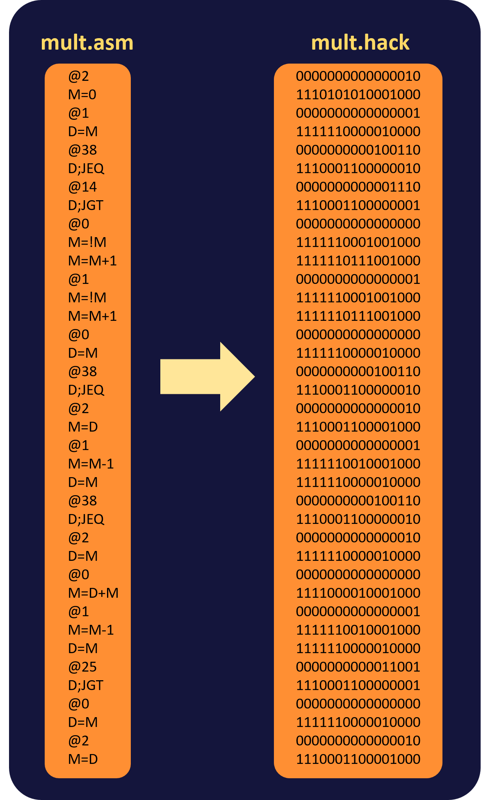
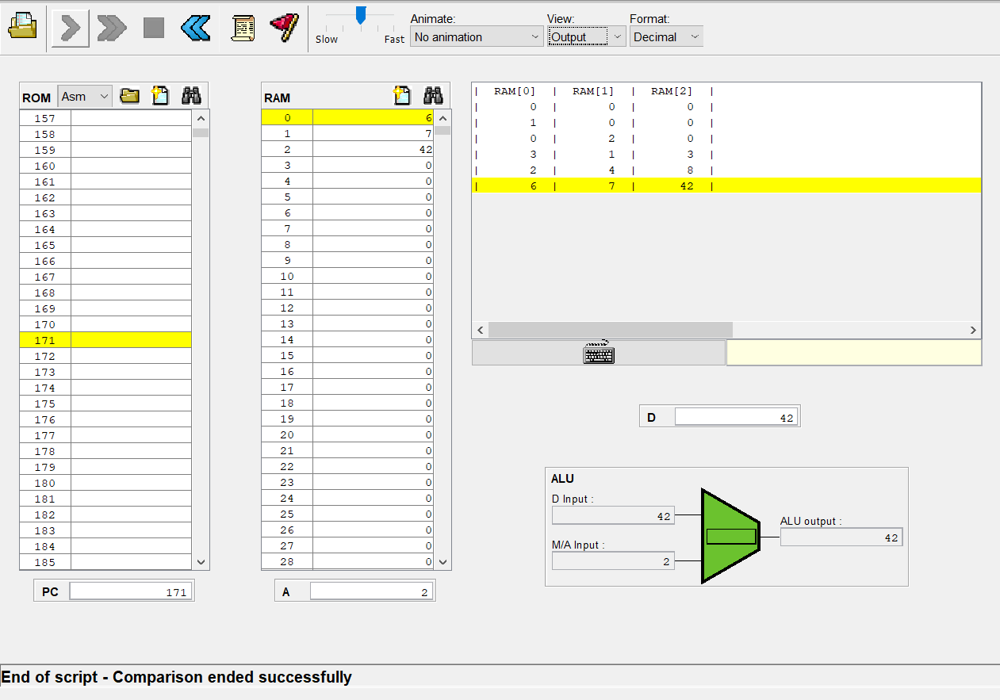

第十週習題 -- 第四章第二題 Fill.asm
===
## Code
```
// This file is part of www.nand2tetris.org
// and the book "The Elements of Computing Systems"
// by Nisan and Schocken, MIT Press.
// File name: projects/04/Mult.asm

// Multiplies R0 and R1 and stores the result in R2.
// (R0, R1, R2 refer to RAM[0], RAM[1], and RAM[2], respectively.)

// NUBLETZ NOTES : Lets say RAM[0] * RAM[1] = RAM[2] as x*y = z. 
                   this program would do a loop for y-1 times.
                   For example if x = 5 and y = 3 then we just need to add x with 5 for 2 times.
                   The first value of x would first stored in RAM[2].
                   during the loop, x value would be add by the value in RAM[2].
                   E.x.
                       RAM[0] = 3
                       RAM[1] = 2
                       RAM[2] = 0 (still empty)

                       1. The value from RAM[0] stored in RAM[2]
                       RAM[0] = 3
                       RAM[1] = 2
                       RAM[2] = 3

                       2. Decrease the value from RAM[1] by one (because we only need to loop for y-1 time (RAM[1]-1))
                       RAM[0] = 3
                       RAM[1] = 1
                       RAM[2] = 3

                       3. Add RAM[0] by RAM[2]
                       RAM[0] = 6
                       RAM[1] = 1
                       RAM[2] = 3

                       4. Decrease the RAM[1] value by 1
                       RAM[0] = 6
                       RAM[1] = 0
                       RAM[2] = 3

                       5. Since the value of RAM[1] equal to zero, so the loop is over.
                       The program would store value in RAM[0] into RAM[2] as a final result.
                       RAM[0] = 6
                       RAM[1] = 0
                       RAM[2] = 6

// Put your code here.
	@2
	M=0 //set RAM[2] value into 0
	@1
	D=M
	@38
	D;JEQ //check if RAM[1] == 0, jump into the conclusion RAM[2] = 0. Because 0 * x = 0
	@14
	D;JGT // else if RAM[1] is greater than 0, jump to line 14
	@0 //else if RAM[1] is negative
	M=!M //set RAM[0] value into negative
	M=M+1 //Add RAM[0] value by 1, because M = !M would be M = -1 * (M+1).. e.x (M = 5; !M = -6)
	@1
	M=!M //set RAM[1] = !RAM[1] so the value would be positive
	M=M+1 //Just like before, we add !M value by 1
	@0
	D=M
	@38
	D;JEQ //check if RAM[0] == 0, jump into the conclusion RAM[2] = 0. Because x * 0 = 0
	@2
	M=D //set RAM[2] value equal to RAM[0]
	@1
	M=M-1 //Decrease RAM[1] value by 1
	D=M
	@38
	D;JEQ //If RAM[1] value equal to zero, then the result from this multiplication is equal to RAM[0] because x * 1 = x
	@2 //line 25 (start loop program)
	D=M //Take the value from RAM[2]. Remember that we store the first value of RAM[0] here.
	@0
	M=D+M //Add RAM[0] by RAM[2]
	@1
	M=M-1 //decrease the total loop that need to do
	D=M 
	@25
	D;JGT //if the loop value haven't reach 0, the program would go back to line 25
	@0 //after finish the loop, read the value in ROM[0](final result)
	D=M
	@2
	M=D //write the final value in RAM[2]
```
## Picture


> Translating asm program into hack, using Assembler.bat



> The output result
