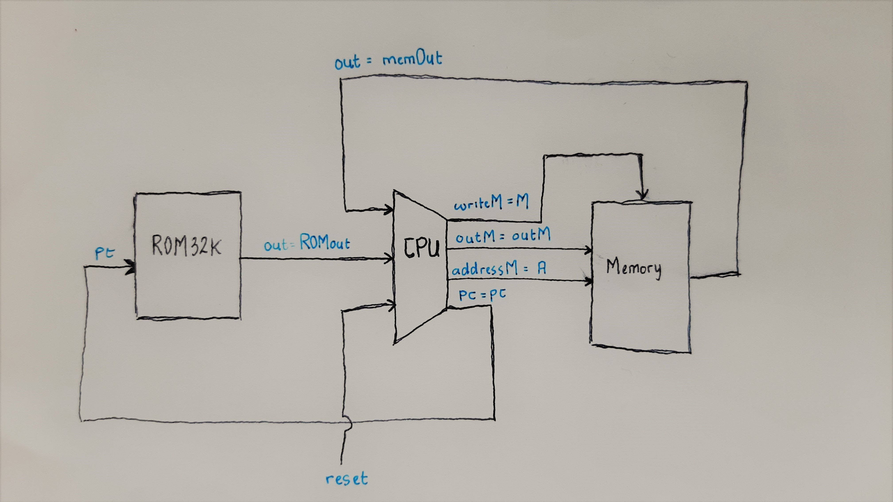

第 13 週習題 -- 第五章完成 Computer.hdl
===

> This file has been tested using :
> * ComputerAdd.tst
> * ComputerAdd-external.tst
> * ComputerMax.tst
> * ComputerMax-external.tst
> * ComputerRect.tst
> * ComputerRect-external.tst

### 1. Picture


### 2. Code
```
// This file is part of www.nand2tetris.org
// and the book "The Elements of Computing Systems"
// by Nisan and Schocken, MIT Press.
// File name: projects/05/Computer.hdl

/**
 * The HACK computer, including CPU, ROM and RAM.
 * When reset is 0, the program stored in the computer's ROM executes.
 * When reset is 1, the execution of the program restarts. 
 * Thus, to start a program's execution, reset must be pushed "up" (1)
 * and "down" (0). From this point onward the user is at the mercy of 
 * the software. In particular, depending on the program's code, the 
 * screen may show some output and the user may be able to interact 
 * with the computer via the keyboard.
 */

CHIP Computer {

    IN reset;

    PARTS:
    // Put your code here:
    ROM32K(address=pc, out=ROMout);
    CPU(inM=memOut, instruction=ROMout, reset=reset, outM=outM, writeM=M, addressM=A, pc=pc);
    Memory(in=outM, load=M, address=A, out=memOut);
}
```
