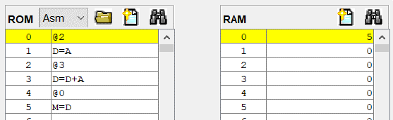
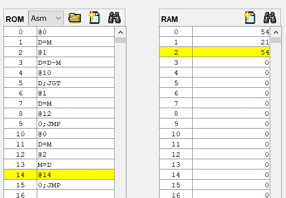
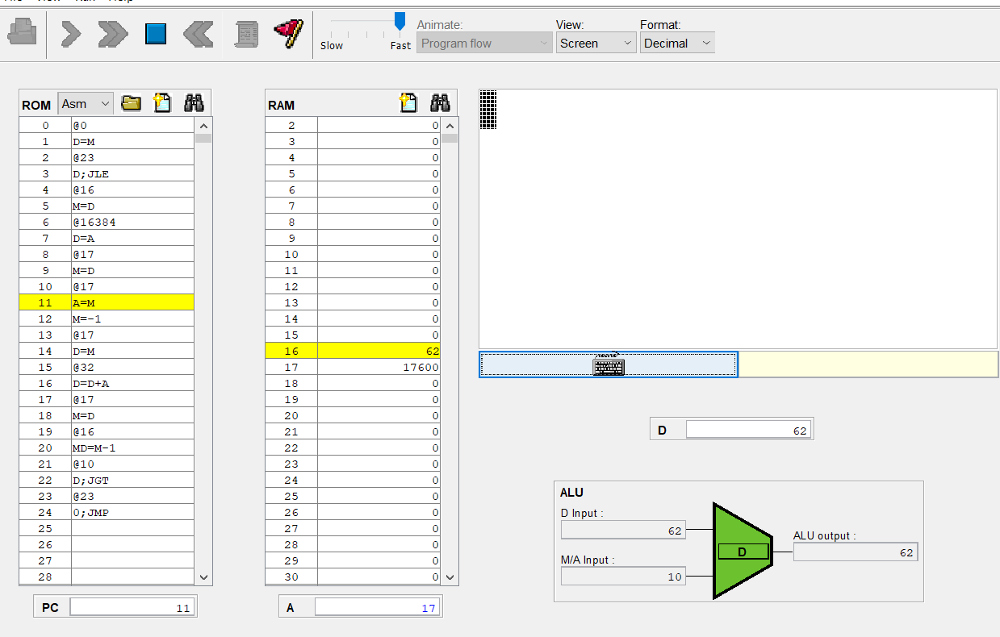
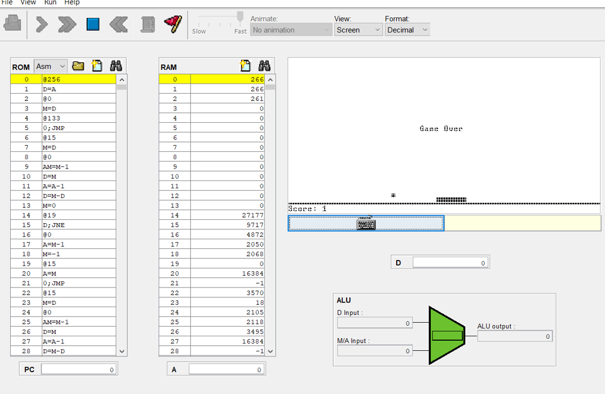

## 第六章習題 組譯器有符號版

> Part 6 assembler with symbol handling capabilities. This part was solved by using the code from https://gitlab.com/ccc109/co/-/tree/master/06.

### 1. Add.asm
<pre>
command : ../asm Add

show result

============= PASS1 ================
00:@2
01:D=A
02:@3
03:D=D+A
04:@0
05:M=D
============= PASS2 ================
00: @2                   0000000000000010 0002
01: D=A                  1110110000010000 ec10
02: @3                   0000000000000011 0003
03: D=D+A                1110000010010000 e090
04: @0                   0000000000000000 0000
05: M=D                  1110001100001000 e308

command : ../dasm Add

show result

@12079
@21536
@26984
@8307 
@26982
@25964
@26912
@8307 
@24944
@29810
@28448
@8294 
@30583
@11895
@24942
@25710
@29746
@29797
@26994
@11891
@29295
@3431 
@12042
@8239 
@28257
@8292
@26740
@8293
@28514
@27503
@8736
@26708
@8293
@27717
@28005
@28261
@29556
@28448
@8294
@28483
@28781
@29813
@28265
@8295
@31059
@29811
@28005
@8819
@2573
@12079
@25120
@8313
@26958
@24947
@8302
@28257
@8292
@25427
@28520
@27491
@28261
@8236
@18765
@8276
@29264
@29541
@11891
@2573
@12079
@17952
@27753
@8293
@24942
@25965
@8250
@29296
@27247
@25445
@29556
@12335
@12086
@25697
@12132
@25665
@11876
@29537
@3437
@3338
@12042
@8239
@28483
@28781
@29813
@29541
@21024
@8240
@8253
@8242
@8235
@8243
@10272
@12370
@29216
@26213
@29285
@8307
@28532
@21024
@19777
@12379
@10589
@2573
@2573
@12864
@2573
@15684
@3393
@16394
@3379
@17418
@17469
@16683
@2573
@12352
@2573
@15693
@3396

command : ../vm Add

show result

PC=0000 I=2F2F A=2F2F D=0000 m[A]=0000=0000
PC=0001 I=5420 A=5420 D=0000 m[A]=0000=0000
PC=0002 I=6968 A=6968 D=0000 m[A]=0000=0000
PC=0003 I=2073 A=2073 D=0000 m[A]=0000=0000
PC=0004 I=6966 A=6966 D=0000 m[A]=0000=0000
PC=0005 I=656C A=656C D=0000 m[A]=0000=0000
PC=0006 I=6920 A=6920 D=0000 m[A]=0000=0000
PC=0007 I=2073 A=2073 D=0000 m[A]=0000=0000
PC=0008 I=6170 A=6170 D=0000 m[A]=0000=0000
PC=0009 I=7472 A=7472 D=0000 m[A]=0000=0000
PC=000A I=6F20 A=6F20 D=0000 m[A]=0000=0000
PC=000B I=2066 A=2066 D=0000 m[A]=0000=0000
PC=000C I=7777 A=7777 D=0000 m[A]=0000=0000
PC=000D I=2E77 A=2E77 D=0000 m[A]=0000=0000
PC=000E I=616E A=616E D=0000 m[A]=0000=0000
PC=000F I=646E A=646E D=0000 m[A]=0000=0000
PC=0010 I=7432 A=7432 D=0000 m[A]=0000=0000
PC=0011 I=7465 A=7465 D=0000 m[A]=0000=0000
PC=0012 I=6972 A=6972 D=0000 m[A]=0000=0000
PC=0013 I=2E73 A=2E73 D=0000 m[A]=0000=0000
PC=0014 I=726F A=726F D=0000 m[A]=0000=0000
PC=0015 I=0D67 A=0D67 D=0000 m[A]=0000=0000
PC=0016 I=2F0A A=2F0A D=0000 m[A]=0000=0000
PC=0017 I=202F A=202F D=0000 m[A]=0000=0000
PC=0018 I=6E61 A=6E61 D=0000 m[A]=0000=0000
PC=0019 I=2064 A=2064 D=0000 m[A]=0000=0000
PC=001A I=6874 A=6874 D=0000 m[A]=0000=0000
PC=001B I=2065 A=2065 D=0000 m[A]=0000=0000
PC=001C I=6F62 A=6F62 D=0000 m[A]=0000=0000
PC=001D I=6B6F A=6B6F D=0000 m[A]=0000=0000
PC=001E I=2220 A=2220 D=0000 m[A]=0000=0000
PC=001F I=6854 A=6854 D=0000 m[A]=0000=0000
PC=0020 I=2065 A=2065 D=0000 m[A]=0000=0000
PC=0021 I=6C45 A=6C45 D=0000 m[A]=0000=0000
PC=0022 I=6D65 A=6D65 D=0000 m[A]=0000=0000
PC=0023 I=6E65 A=6E65 D=0000 m[A]=0000=0000
PC=0024 I=7374 A=7374 D=0000 m[A]=0000=0000
PC=0025 I=6F20 A=6F20 D=0000 m[A]=0000=0000
PC=0026 I=2066 A=2066 D=0000 m[A]=0000=0000
PC=0027 I=6F43 A=6F43 D=0000 m[A]=0000=0000
PC=0028 I=706D A=706D D=0000 m[A]=0000=0000
PC=0029 I=7475 A=7475 D=0000 m[A]=0000=0000
PC=002A I=6E69 A=6E69 D=0000 m[A]=0000=0000
PC=002B I=2067 A=2067 D=0000 m[A]=0000=0000
PC=002C I=7953 A=7953 D=0000 m[A]=0000=0000
PC=002D I=7473 A=7473 D=0000 m[A]=0000=0000
PC=002E I=6D65 A=6D65 D=0000 m[A]=0000=0000
PC=002F I=2273 A=2273 D=0000 m[A]=0000=0000
PC=0030 I=0A0D A=0A0D D=0000 m[A]=0000=0000
PC=0031 I=2F2F A=2F2F D=0000 m[A]=0000=0000
PC=0032 I=6220 A=6220 D=0000 m[A]=0000=0000
PC=0033 I=2079 A=2079 D=0000 m[A]=0000=0000
PC=0034 I=694E A=694E D=0000 m[A]=0000=0000
PC=0035 I=6173 A=6173 D=0000 m[A]=0000=0000
PC=0036 I=206E A=206E D=0000 m[A]=0000=0000
PC=0037 I=6E61 A=6E61 D=0000 m[A]=0000=0000
PC=0038 I=2064 A=2064 D=0000 m[A]=0000=0000
PC=0039 I=6353 A=6353 D=0000 m[A]=0000=0000
PC=003A I=6F68 A=6F68 D=0000 m[A]=0000=0000
PC=003B I=6B63 A=6B63 D=0000 m[A]=0000=0000
PC=003C I=6E65 A=6E65 D=0000 m[A]=0000=0000
PC=003D I=202C A=202C D=0000 m[A]=0000=0000
PC=003E I=494D A=494D D=0000 m[A]=0000=0000
PC=003F I=2054 A=2054 D=0000 m[A]=0000=0000
PC=0040 I=7250 A=7250 D=0000 m[A]=0000=0000
PC=0041 I=7365 A=7365 D=0000 m[A]=0000=0000
PC=0042 I=2E73 A=2E73 D=0000 m[A]=0000=0000
PC=0043 I=0A0D A=0A0D D=0000 m[A]=0000=0000
PC=0044 I=2F2F A=2F2F D=0000 m[A]=0000=0000
PC=0045 I=4620 A=4620 D=0000 m[A]=0000=0000
PC=0046 I=6C69 A=6C69 D=0000 m[A]=0000=0000
PC=0047 I=2065 A=2065 D=0000 m[A]=0000=0000
PC=0048 I=616E A=616E D=0000 m[A]=0000=0000
PC=0049 I=656D A=656D D=0000 m[A]=0000=0000
PC=004A I=203A A=203A D=0000 m[A]=0000=0000
PC=004B I=7270 A=7270 D=0000 m[A]=0000=0000
PC=004C I=6A6F A=6A6F D=0000 m[A]=0000=0000
PC=004D I=6365 A=6365 D=0000 m[A]=0000=0000
PC=004E I=7374 A=7374 D=0000 m[A]=0000=0000
PC=004F I=302F A=302F D=0000 m[A]=0000=0000
PC=0050 I=2F36 A=2F36 D=0000 m[A]=0000=0000
PC=0051 I=6461 A=6461 D=0000 m[A]=0000=0000
PC=0052 I=2F64 A=2F64 D=0000 m[A]=0000=0000
PC=0053 I=6441 A=6441 D=0000 m[A]=0000=0000
PC=0054 I=2E64 A=2E64 D=0000 m[A]=0000=0000
PC=0055 I=7361 A=7361 D=0000 m[A]=0000=0000
PC=0056 I=0D6D A=0D6D D=0000 m[A]=0000=0000
PC=0057 I=0D0A A=0D0A D=0000 m[A]=0000=0000
PC=0058 I=2F0A A=2F0A D=0000 m[A]=0000=0000
PC=0059 I=202F A=202F D=0000 m[A]=0000=0000
PC=005A I=6F43 A=6F43 D=0000 m[A]=0000=0000
PC=005B I=706D A=706D D=0000 m[A]=0000=0000
PC=005C I=7475 A=7475 D=0000 m[A]=0000=0000
PC=005D I=7365 A=7365 D=0000 m[A]=0000=0000
PC=005E I=5220 A=5220 D=0000 m[A]=0000=0000
PC=005F I=2030 A=2030 D=0000 m[A]=0000=0000
PC=0060 I=203D A=203D D=0000 m[A]=0000=0000
PC=0061 I=2032 A=2032 D=0000 m[A]=0000=0000
PC=0062 I=202B A=202B D=0000 m[A]=0000=0000
PC=0063 I=2033 A=2033 D=0000 m[A]=0000=0000
PC=0064 I=2820 A=2820 D=0000 m[A]=0000=0000
PC=0065 I=3052 A=3052 D=0000 m[A]=0000=0000
PC=0066 I=7220 A=7220 D=0000 m[A]=0000=0000
PC=0067 I=6665 A=6665 D=0000 m[A]=0000=0000
PC=0068 I=7265 A=7265 D=0000 m[A]=0000=0000
PC=0069 I=2073 A=2073 D=0000 m[A]=0000=0000
PC=006A I=6F74 A=6F74 D=0000 m[A]=0000=0000
PC=006B I=5220 A=5220 D=0000 m[A]=0000=0000
PC=006C I=4D41 A=4D41 D=0000 m[A]=0000=0000
PC=006D I=305B A=305B D=0000 m[A]=0000=0000
PC=006E I=295D A=295D D=0000 m[A]=0000=0000
PC=006F I=0A0D A=0A0D D=0000 m[A]=0000=0000
PC=0070 I=0A0D A=0A0D D=0000 m[A]=0000=0000
PC=0071 I=3240 A=3240 D=0000 m[A]=0000=0000
PC=0072 I=0A0D A=0A0D D=0000 m[A]=0000=0000
PC=0073 I=3D44 A=3D44 D=0000 m[A]=0000=0000
PC=0074 I=0D41 A=0D41 D=0000 m[A]=0000=0000
PC=0075 I=400A A=400A D=0000 m[A]=0000=0000
PC=0076 I=0D33 A=0D33 D=0000 m[A]=0000=0000
PC=0077 I=440A A=440A D=0000 m[A]=0000=0000
PC=0078 I=443D A=443D D=0000 m[A]=0000=0000
PC=0079 I=412B A=412B D=0000 m[A]=0000=0000
PC=007A I=0A0D A=0A0D D=0000 m[A]=0000=0000
PC=007B I=3040 A=3040 D=0000 m[A]=0000=0000
PC=007C I=0A0D A=0A0D D=0000 m[A]=0000=0000
PC=007D I=3D4D A=3D4D D=0000 m[A]=0000=0000
PC=007E I=0D44 A=0D44 D=0000 m[A]=0000=0000
exit program !

</pre>

> Adds up the constants 2 and 3 and puts the result in R0.

### 2. Max.asm
<pre>
command : ../asm Max

show result

============= PASS1 ================
00:@R0
01:D=M
02:@R1
03:D=D-M
04:@OUTPUT_FIRST
05:D;JGT
06:@R1
07:D=M
08:@OUTPUT_D        
09:0;JMP
10:(OUTPUT_FIRST)
symbol:OUTPUT_FIRST address=10
10:@R0
11:D=M
12:(OUTPUT_D)
symbol:OUTPUT_D address=12
12:@R2
13:M=D
14:(INFINITE_LOOP)
symbol:INFINITE_LOOP address=14
14:@INFINITE_LOOP
15:0;JMP
============= PASS2 ================
00: @R0                  0000000000000000 0000
01: D=M                  1111110000010000 fc10
02: @R1                  0000000000000001 0001
03: D=D-M                1111010011010000 f4d0
04: @OUTPUT_FIRST        0000000000001010 000a
05: D;JGT                1110001100000001 e301
06: @R1                  0000000000000001 0001
07: D=M                  1111110000010000 fc10
08: @OUTPUT_D            0000000000001100 000c
09: 0;JMP                1110101010000111 ea87
(OUTPUT_FIRST)
0A: @R0                  0000000000000000 0000
0B: D=M                  1111110000010000 fc10
(OUTPUT_D)
0C: @R2                  0000000000000010 0002
0D: M=D                  1110001100001000 e308
(INFINITE_LOOP)
0E: @INFINITE_LOOP       0000000000001110 000e
0F: 0;JMP                1110101010000111 ea87

command : ../dasm Max

show result

@12079
@21536
@26984
@8307
@26982
@25964
@26912
@8307
@24944
@29810
@28448
@8294
@30583
@11895
@24942
@25710
@29746
@29797
@26994
@11891
@29295
@3431
@12042
@8239
@28257
@8292
@26740
@8293
@28514
@27503
@8736
@26708
@8293
@27717
@28005
@28261
@29556
@28448
@8294
@28483
@28781
@29813
@28265
@8295
@31059
@29811
@28005
@8819
@2573
@12079
@25120
@8313
@26958
@24947
@8302
@28257
@8292
@25427
@28520
@27491
@28261
@8236
@18765
@8276
@29264
@29541
@11891
@2573
@12079
@17952
@27753
@8293
@24942
@25965
@8250
@29296
@27247
@25445
@29556
@12335
@12086
@24941
@12152
@24909
@11896
@29537
@3437
@3338
@12042
@8239
@28483
@28781
@29813
@29541
@21024
@8242
@8253
@24941
@10360
@12370
@8236
@12626
@8233
@10272
@12370
@21036
@11313
@12882
@29216
@26213
@29285
@29728
@8303
@16722
@23373
@23856
@21036
@19777
@12635
@11357
@16722
@23373
@23858
@3369
@3338
@8202
@8224
@21056
@3376
@8202
@8224
@15684
@8269
@8224
@8224
@8224
@8224
@8224
@8224
@12064
@8239
@8260
@8253
@26982
@29554
@8308
@30062
@25197
@29285
@2573
@8224
@16416
@12626
@2573
@8224
@17440
@17469
@19757
@8224
@8224
@8224
@8224
@8224
@8224
@12079
@17440
@15648
@26144
@29289
@29811
@28192
@28021
@25954
@8306
@8237
@25971
@28515
@25710
@28192
@28021
@25954
@3442
@8202
@8224
@20288
@21589
@21840
@24404
@18758
@21330
@3412
@8202
@8224
@15172
@18250
@8276
@8224
@8224
@8224
@8224
@8224
@12064
@8239
@26217
@17440
@12350
@10272
@26982
@29554
@8308
@29545
@26400
@25970
@29793
@29285
@8233
@28519
@28532
@28448
@29813
@30064
@24436
@26982
@29554
@3444
@8202
@8224
@21056
@3377
@8202
@8224
@15684
@8269
@8224
@8224
@8224
@8224
@8224
@8224
@12064
@8239
@8260
@8253
@25971
@28515
@25710
@28192
@28021
@25954
@3442
@8202
@8224
@20288
@21589
@21840
@24404
@3396
@8202
@8224
@15152
@19786
@8272
@8224
@8224
@8224
@8224
@8224
@12064
@8239
@28519
@28532
@28448
@29813
@30064
@24436
@3428
@10250
@21839
@20564
@21589
@18015
@21065
@21587
@3369
@8202
@8224
@21056
@8240
@8224
@8224
@8224
@8224
@8224
@8224
@2573
@8224
@17440
@19773
@8224
@8224
@8224
@8224
@8224
@8224
@8224
@12079
@17440
@15648
@26144
@29289
@29811
@28192
@28021
@25954
@3442
@10250
@21839
@20564
@21589
@17503
@3369
@8202
@8224
@21056
@3378
@8202
@8224
@15693
@8260
@8224
@8224
@8224
@8224
@8224
@8224
@12064
@8239
@23373
@23858
@15648
@17440
@10272
@29287
@24933
@25972
@29811
@28192
@28021
@25954
@10610
@2573
@18728
@17998
@20041
@21577
@24389
@20300
@20559
@3369
@8202
@8224
@18752
@17998
@20041
@21577
@24389
@20300
@20559
@2573
@8224
@12320
@19003
@20557
@8224
@8224
@8224
@8224
@8224
@8224
@12079
@26912
@26222
@28265
@29801
@8293
@28524
@28783
@2573

command : ../vm Max

show result

PC=0000 I=2F2F A=2F2F D=0000 m[A]=0000=0000
PC=0001 I=5420 A=5420 D=0000 m[A]=0000=0000
PC=0002 I=6968 A=6968 D=0000 m[A]=0000=0000
PC=0003 I=2073 A=2073 D=0000 m[A]=0000=0000
PC=0004 I=6966 A=6966 D=0000 m[A]=0000=0000
PC=0005 I=656C A=656C D=0000 m[A]=0000=0000
PC=0006 I=6920 A=6920 D=0000 m[A]=0000=0000
PC=0007 I=2073 A=2073 D=0000 m[A]=0000=0000
PC=0008 I=6170 A=6170 D=0000 m[A]=0000=0000
PC=0009 I=7472 A=7472 D=0000 m[A]=0000=0000
PC=000A I=6F20 A=6F20 D=0000 m[A]=0000=0000
PC=000B I=2066 A=2066 D=0000 m[A]=0000=0000
PC=000C I=7777 A=7777 D=0000 m[A]=0000=0000
PC=000D I=2E77 A=2E77 D=0000 m[A]=0000=0000
PC=000E I=616E A=616E D=0000 m[A]=0000=0000
PC=000F I=646E A=646E D=0000 m[A]=0000=0000
PC=0010 I=7432 A=7432 D=0000 m[A]=0000=0000
PC=0011 I=7465 A=7465 D=0000 m[A]=0000=0000
PC=0012 I=6972 A=6972 D=0000 m[A]=0000=0000
PC=0013 I=2E73 A=2E73 D=0000 m[A]=0000=0000
PC=0014 I=726F A=726F D=0000 m[A]=0000=0000
PC=0015 I=0D67 A=0D67 D=0000 m[A]=0000=0000
PC=0016 I=2F0A A=2F0A D=0000 m[A]=0000=0000
PC=0017 I=202F A=202F D=0000 m[A]=0000=0000
PC=0018 I=6E61 A=6E61 D=0000 m[A]=0000=0000
PC=0019 I=2064 A=2064 D=0000 m[A]=0000=0000
PC=001A I=6874 A=6874 D=0000 m[A]=0000=0000
PC=001B I=2065 A=2065 D=0000 m[A]=0000=0000
PC=001C I=6F62 A=6F62 D=0000 m[A]=0000=0000
PC=001D I=6B6F A=6B6F D=0000 m[A]=0000=0000
PC=001E I=2220 A=2220 D=0000 m[A]=0000=0000
PC=001F I=6854 A=6854 D=0000 m[A]=0000=0000
PC=0020 I=2065 A=2065 D=0000 m[A]=0000=0000
PC=0021 I=6C45 A=6C45 D=0000 m[A]=0000=0000
PC=0022 I=6D65 A=6D65 D=0000 m[A]=0000=0000
PC=0023 I=6E65 A=6E65 D=0000 m[A]=0000=0000
PC=0024 I=7374 A=7374 D=0000 m[A]=0000=0000
PC=0025 I=6F20 A=6F20 D=0000 m[A]=0000=0000
PC=0026 I=2066 A=2066 D=0000 m[A]=0000=0000
PC=0027 I=6F43 A=6F43 D=0000 m[A]=0000=0000
PC=0028 I=706D A=706D D=0000 m[A]=0000=0000
PC=0029 I=7475 A=7475 D=0000 m[A]=0000=0000
PC=002A I=6E69 A=6E69 D=0000 m[A]=0000=0000
PC=002B I=2067 A=2067 D=0000 m[A]=0000=0000
PC=002C I=7953 A=7953 D=0000 m[A]=0000=0000
PC=002D I=7473 A=7473 D=0000 m[A]=0000=0000
PC=002E I=6D65 A=6D65 D=0000 m[A]=0000=0000
PC=002F I=2273 A=2273 D=0000 m[A]=0000=0000
PC=0030 I=0A0D A=0A0D D=0000 m[A]=0000=0000
PC=0031 I=2F2F A=2F2F D=0000 m[A]=0000=0000
PC=0032 I=6220 A=6220 D=0000 m[A]=0000=0000
PC=0033 I=2079 A=2079 D=0000 m[A]=0000=0000
PC=0034 I=694E A=694E D=0000 m[A]=0000=0000
PC=0035 I=6173 A=6173 D=0000 m[A]=0000=0000
PC=0036 I=206E A=206E D=0000 m[A]=0000=0000
PC=0037 I=6E61 A=6E61 D=0000 m[A]=0000=0000
PC=0038 I=2064 A=2064 D=0000 m[A]=0000=0000
PC=0039 I=6353 A=6353 D=0000 m[A]=0000=0000
PC=003A I=6F68 A=6F68 D=0000 m[A]=0000=0000
PC=003B I=6B63 A=6B63 D=0000 m[A]=0000=0000
PC=003C I=6E65 A=6E65 D=0000 m[A]=0000=0000
PC=003D I=202C A=202C D=0000 m[A]=0000=0000
PC=003E I=494D A=494D D=0000 m[A]=0000=0000
PC=003F I=2054 A=2054 D=0000 m[A]=0000=0000
PC=0040 I=7250 A=7250 D=0000 m[A]=0000=0000
PC=0041 I=7365 A=7365 D=0000 m[A]=0000=0000
PC=0042 I=2E73 A=2E73 D=0000 m[A]=0000=0000
PC=0043 I=0A0D A=0A0D D=0000 m[A]=0000=0000
PC=0044 I=2F2F A=2F2F D=0000 m[A]=0000=0000
PC=0045 I=4620 A=4620 D=0000 m[A]=0000=0000
PC=0046 I=6C69 A=6C69 D=0000 m[A]=0000=0000
PC=0047 I=2065 A=2065 D=0000 m[A]=0000=0000
PC=0048 I=616E A=616E D=0000 m[A]=0000=0000
PC=0049 I=656D A=656D D=0000 m[A]=0000=0000
PC=004A I=203A A=203A D=0000 m[A]=0000=0000
PC=004B I=7270 A=7270 D=0000 m[A]=0000=0000
PC=004C I=6A6F A=6A6F D=0000 m[A]=0000=0000
PC=004D I=6365 A=6365 D=0000 m[A]=0000=0000
PC=004E I=7374 A=7374 D=0000 m[A]=0000=0000
PC=004F I=302F A=302F D=0000 m[A]=0000=0000
PC=0050 I=2F36 A=2F36 D=0000 m[A]=0000=0000
PC=0051 I=616D A=616D D=0000 m[A]=0000=0000
PC=0052 I=2F78 A=2F78 D=0000 m[A]=0000=0000
PC=0053 I=614D A=614D D=0000 m[A]=0000=0000
PC=0054 I=2E78 A=2E78 D=0000 m[A]=0000=0000
PC=0055 I=7361 A=7361 D=0000 m[A]=0000=0000
PC=0056 I=0D6D A=0D6D D=0000 m[A]=0000=0000
PC=0057 I=0D0A A=0D0A D=0000 m[A]=0000=0000
PC=0058 I=2F0A A=2F0A D=0000 m[A]=0000=0000
PC=0059 I=202F A=202F D=0000 m[A]=0000=0000
PC=005A I=6F43 A=6F43 D=0000 m[A]=0000=0000
PC=005B I=706D A=706D D=0000 m[A]=0000=0000
PC=005C I=7475 A=7475 D=0000 m[A]=0000=0000
PC=005D I=7365 A=7365 D=0000 m[A]=0000=0000
PC=005E I=5220 A=5220 D=0000 m[A]=0000=0000
PC=005F I=2032 A=2032 D=0000 m[A]=0000=0000
PC=0060 I=203D A=203D D=0000 m[A]=0000=0000
PC=0061 I=616D A=616D D=0000 m[A]=0000=0000
PC=0062 I=2878 A=2878 D=0000 m[A]=0000=0000
PC=0063 I=3052 A=3052 D=0000 m[A]=0000=0000
PC=0064 I=202C A=202C D=0000 m[A]=0000=0000
PC=0065 I=3152 A=3152 D=0000 m[A]=0000=0000
PC=0066 I=2029 A=2029 D=0000 m[A]=0000=0000
PC=0067 I=2820 A=2820 D=0000 m[A]=0000=0000
PC=0068 I=3052 A=3052 D=0000 m[A]=0000=0000
PC=0069 I=522C A=522C D=0000 m[A]=0000=0000
PC=006A I=2C31 A=2C31 D=0000 m[A]=0000=0000
PC=006B I=3252 A=3252 D=0000 m[A]=0000=0000
PC=006C I=7220 A=7220 D=0000 m[A]=0000=0000
PC=006D I=6665 A=6665 D=0000 m[A]=0000=0000
PC=006E I=7265 A=7265 D=0000 m[A]=0000=0000
PC=006F I=7420 A=7420 D=0000 m[A]=0000=0000
PC=0070 I=206F A=206F D=0000 m[A]=0000=0000
PC=0071 I=4152 A=4152 D=0000 m[A]=0000=0000
PC=0072 I=5B4D A=5B4D D=0000 m[A]=0000=0000
PC=0073 I=5D30 A=5D30 D=0000 m[A]=0000=0000
PC=0074 I=522C A=522C D=0000 m[A]=0000=0000
PC=0075 I=4D41 A=4D41 D=0000 m[A]=0000=0000
PC=0076 I=315B A=315B D=0000 m[A]=0000=0000
PC=0077 I=2C5D A=2C5D D=0000 m[A]=0000=0000
PC=0078 I=4152 A=4152 D=0000 m[A]=0000=0000
PC=0079 I=5B4D A=5B4D D=0000 m[A]=0000=0000
PC=007A I=5D32 A=5D32 D=0000 m[A]=0000=0000
PC=007B I=0D29 A=0D29 D=0000 m[A]=0000=0000
PC=007C I=0D0A A=0D0A D=0000 m[A]=0000=0000
PC=007D I=200A A=200A D=0000 m[A]=0000=0000
PC=007E I=2020 A=2020 D=0000 m[A]=0000=0000
PC=007F I=5240 A=5240 D=0000 m[A]=0000=0000
PC=0080 I=0D30 A=0D30 D=0000 m[A]=0000=0000
PC=0081 I=200A A=200A D=0000 m[A]=0000=0000
PC=0082 I=2020 A=2020 D=0000 m[A]=0000=0000
PC=0083 I=3D44 A=3D44 D=0000 m[A]=0000=0000
PC=0084 I=204D A=204D D=0000 m[A]=0000=0000
PC=0085 I=2020 A=2020 D=0000 m[A]=0000=0000
PC=0086 I=2020 A=2020 D=0000 m[A]=0000=0000
PC=0087 I=2020 A=2020 D=0000 m[A]=0000=0000
PC=0088 I=2020 A=2020 D=0000 m[A]=0000=0000
PC=0089 I=2020 A=2020 D=0000 m[A]=0000=0000
PC=008A I=2020 A=2020 D=0000 m[A]=0000=0000
PC=008B I=2F20 A=2F20 D=0000 m[A]=0000=0000
PC=008C I=202F A=202F D=0000 m[A]=0000=0000
PC=008D I=2044 A=2044 D=0000 m[A]=0000=0000
PC=008E I=203D A=203D D=0000 m[A]=0000=0000
PC=008F I=6966 A=6966 D=0000 m[A]=0000=0000
PC=0090 I=7372 A=7372 D=0000 m[A]=0000=0000
PC=0091 I=2074 A=2074 D=0000 m[A]=0000=0000
PC=0092 I=756E A=756E D=0000 m[A]=0000=0000
PC=0093 I=626D A=626D D=0000 m[A]=0000=0000
PC=0094 I=7265 A=7265 D=0000 m[A]=0000=0000
PC=0095 I=0A0D A=0A0D D=0000 m[A]=0000=0000
PC=0096 I=2020 A=2020 D=0000 m[A]=0000=0000
PC=0097 I=4020 A=4020 D=0000 m[A]=0000=0000
PC=0098 I=3152 A=3152 D=0000 m[A]=0000=0000
PC=0099 I=0A0D A=0A0D D=0000 m[A]=0000=0000
PC=009A I=2020 A=2020 D=0000 m[A]=0000=0000
PC=009B I=4420 A=4420 D=0000 m[A]=0000=0000
PC=009C I=443D A=443D D=0000 m[A]=0000=0000
PC=009D I=4D2D A=4D2D D=0000 m[A]=0000=0000
PC=009E I=2020 A=2020 D=0000 m[A]=0000=0000
PC=009F I=2020 A=2020 D=0000 m[A]=0000=0000
PC=00A0 I=2020 A=2020 D=0000 m[A]=0000=0000
PC=00A1 I=2020 A=2020 D=0000 m[A]=0000=0000
PC=00A2 I=2020 A=2020 D=0000 m[A]=0000=0000
PC=00A3 I=2020 A=2020 D=0000 m[A]=0000=0000
PC=00A4 I=2F2F A=2F2F D=0000 m[A]=0000=0000
PC=00A5 I=4420 A=4420 D=0000 m[A]=0000=0000
PC=00A6 I=3D20 A=3D20 D=0000 m[A]=0000=0000
PC=00A7 I=6620 A=6620 D=0000 m[A]=0000=0000
PC=00A8 I=7269 A=7269 D=0000 m[A]=0000=0000
PC=00A9 I=7473 A=7473 D=0000 m[A]=0000=0000
PC=00AA I=6E20 A=6E20 D=0000 m[A]=0000=0000
PC=00AB I=6D75 A=6D75 D=0000 m[A]=0000=0000
PC=00AC I=6562 A=6562 D=0000 m[A]=0000=0000
PC=00AD I=2072 A=2072 D=0000 m[A]=0000=0000
PC=00AE I=202D A=202D D=0000 m[A]=0000=0000
PC=00AF I=6573 A=6573 D=0000 m[A]=0000=0000
PC=00B0 I=6F63 A=6F63 D=0000 m[A]=0000=0000
PC=00B1 I=646E A=646E D=0000 m[A]=0000=0000
PC=00B2 I=6E20 A=6E20 D=0000 m[A]=0000=0000
PC=00B3 I=6D75 A=6D75 D=0000 m[A]=0000=0000
PC=00B4 I=6562 A=6562 D=0000 m[A]=0000=0000
PC=00B5 I=0D72 A=0D72 D=0000 m[A]=0000=0000
PC=00B6 I=200A A=200A D=0000 m[A]=0000=0000
PC=00B7 I=2020 A=2020 D=0000 m[A]=0000=0000
PC=00B8 I=4F40 A=4F40 D=0000 m[A]=0000=0000
PC=00B9 I=5455 A=5455 D=0000 m[A]=0000=0000
PC=00BA I=5550 A=5550 D=0000 m[A]=0000=0000
PC=00BB I=5F54 A=5F54 D=0000 m[A]=0000=0000
PC=00BC I=4946 A=4946 D=0000 m[A]=0000=0000
PC=00BD I=5352 A=5352 D=0000 m[A]=0000=0000
PC=00BE I=0D54 A=0D54 D=0000 m[A]=0000=0000
PC=00BF I=200A A=200A D=0000 m[A]=0000=0000
PC=00C0 I=2020 A=2020 D=0000 m[A]=0000=0000
PC=00C1 I=3B44 A=3B44 D=0000 m[A]=0000=0000
PC=00C2 I=474A A=474A D=0000 m[A]=0000=0000
PC=00C3 I=2054 A=2054 D=0000 m[A]=0000=0000
PC=00C4 I=2020 A=2020 D=0000 m[A]=0000=0000
PC=00C5 I=2020 A=2020 D=0000 m[A]=0000=0000
PC=00C6 I=2020 A=2020 D=0000 m[A]=0000=0000
PC=00C7 I=2020 A=2020 D=0000 m[A]=0000=0000
PC=00C8 I=2020 A=2020 D=0000 m[A]=0000=0000
PC=00C9 I=2F20 A=2F20 D=0000 m[A]=0000=0000
PC=00CA I=202F A=202F D=0000 m[A]=0000=0000
PC=00CB I=6669 A=6669 D=0000 m[A]=0000=0000
PC=00CC I=4420 A=4420 D=0000 m[A]=0000=0000
PC=00CD I=303E A=303E D=0000 m[A]=0000=0000
PC=00CE I=2820 A=2820 D=0000 m[A]=0000=0000
PC=00CF I=6966 A=6966 D=0000 m[A]=0000=0000
PC=00D0 I=7372 A=7372 D=0000 m[A]=0000=0000
PC=00D1 I=2074 A=2074 D=0000 m[A]=0000=0000
PC=00D2 I=7369 A=7369 D=0000 m[A]=0000=0000
PC=00D3 I=6720 A=6720 D=0000 m[A]=0000=0000
PC=00D4 I=6572 A=6572 D=0000 m[A]=0000=0000
PC=00D5 I=7461 A=7461 D=0000 m[A]=0000=0000
PC=00D6 I=7265 A=7265 D=0000 m[A]=0000=0000
PC=00D7 I=2029 A=2029 D=0000 m[A]=0000=0000
PC=00D8 I=6F67 A=6F67 D=0000 m[A]=0000=0000
PC=00D9 I=6F74 A=6F74 D=0000 m[A]=0000=0000
PC=00DA I=6F20 A=6F20 D=0000 m[A]=0000=0000
PC=00DB I=7475 A=7475 D=0000 m[A]=0000=0000
PC=00DC I=7570 A=7570 D=0000 m[A]=0000=0000
PC=00DD I=5F74 A=5F74 D=0000 m[A]=0000=0000
PC=00DE I=6966 A=6966 D=0000 m[A]=0000=0000
PC=00DF I=7372 A=7372 D=0000 m[A]=0000=0000
PC=00E0 I=0D74 A=0D74 D=0000 m[A]=0000=0000
PC=00E1 I=200A A=200A D=0000 m[A]=0000=0000
PC=00E2 I=2020 A=2020 D=0000 m[A]=0000=0000
PC=00E3 I=5240 A=5240 D=0000 m[A]=0000=0000
PC=00E4 I=0D31 A=0D31 D=0000 m[A]=0000=0000
PC=00E5 I=200A A=200A D=0000 m[A]=0000=0000
PC=00E6 I=2020 A=2020 D=0000 m[A]=0000=0000
PC=00E7 I=3D44 A=3D44 D=0000 m[A]=0000=0000
PC=00E8 I=204D A=204D D=0000 m[A]=0000=0000
PC=00E9 I=2020 A=2020 D=0000 m[A]=0000=0000
PC=00EA I=2020 A=2020 D=0000 m[A]=0000=0000
PC=00EB I=2020 A=2020 D=0000 m[A]=0000=0000
PC=00EC I=2020 A=2020 D=0000 m[A]=0000=0000
PC=00ED I=2020 A=2020 D=0000 m[A]=0000=0000
PC=00EE I=2020 A=2020 D=0000 m[A]=0000=0000
PC=00EF I=2F20 A=2F20 D=0000 m[A]=0000=0000
PC=00F0 I=202F A=202F D=0000 m[A]=0000=0000
PC=00F1 I=2044 A=2044 D=0000 m[A]=0000=0000
PC=00F2 I=203D A=203D D=0000 m[A]=0000=0000
PC=00F3 I=6573 A=6573 D=0000 m[A]=0000=0000
PC=00F4 I=6F63 A=6F63 D=0000 m[A]=0000=0000
PC=00F5 I=646E A=646E D=0000 m[A]=0000=0000
PC=00F6 I=6E20 A=6E20 D=0000 m[A]=0000=0000
PC=00F7 I=6D75 A=6D75 D=0000 m[A]=0000=0000
PC=00F8 I=6562 A=6562 D=0000 m[A]=0000=0000
PC=00F9 I=0D72 A=0D72 D=0000 m[A]=0000=0000
PC=00FA I=200A A=200A D=0000 m[A]=0000=0000
PC=00FB I=2020 A=2020 D=0000 m[A]=0000=0000
PC=00FC I=4F40 A=4F40 D=0000 m[A]=0000=0000
PC=00FD I=5455 A=5455 D=0000 m[A]=0000=0000
PC=00FE I=5550 A=5550 D=0000 m[A]=0000=0000
PC=00FF I=5F54 A=5F54 D=0000 m[A]=0000=0000
PC=0100 I=0D44 A=0D44 D=0000 m[A]=0000=0000
PC=0101 I=200A A=200A D=0000 m[A]=0000=0000
PC=0102 I=2020 A=2020 D=0000 m[A]=0000=0000
PC=0103 I=3B30 A=3B30 D=0000 m[A]=0000=0000
PC=0104 I=4D4A A=4D4A D=0000 m[A]=0000=0000
PC=0105 I=2050 A=2050 D=0000 m[A]=0000=0000
PC=0106 I=2020 A=2020 D=0000 m[A]=0000=0000
PC=0107 I=2020 A=2020 D=0000 m[A]=0000=0000
PC=0108 I=2020 A=2020 D=0000 m[A]=0000=0000
PC=0109 I=2020 A=2020 D=0000 m[A]=0000=0000
PC=010A I=2020 A=2020 D=0000 m[A]=0000=0000
PC=010B I=2F20 A=2F20 D=0000 m[A]=0000=0000
PC=010C I=202F A=202F D=0000 m[A]=0000=0000
PC=010D I=6F67 A=6F67 D=0000 m[A]=0000=0000
PC=010E I=6F74 A=6F74 D=0000 m[A]=0000=0000
PC=010F I=6F20 A=6F20 D=0000 m[A]=0000=0000
PC=0110 I=7475 A=7475 D=0000 m[A]=0000=0000
PC=0111 I=7570 A=7570 D=0000 m[A]=0000=0000
PC=0112 I=5F74 A=5F74 D=0000 m[A]=0000=0000
PC=0113 I=0D64 A=0D64 D=0000 m[A]=0000=0000
PC=0114 I=280A A=280A D=0000 m[A]=0000=0000
PC=0115 I=554F A=554F D=0000 m[A]=0000=0000
PC=0116 I=5054 A=5054 D=0000 m[A]=0000=0000
PC=0117 I=5455 A=5455 D=0000 m[A]=0000=0000
PC=0118 I=465F A=465F D=0000 m[A]=0000=0000
PC=0119 I=5249 A=5249 D=0000 m[A]=0000=0000
PC=011A I=5453 A=5453 D=0000 m[A]=0000=0000
PC=011B I=0D29 A=0D29 D=0000 m[A]=0000=0000
PC=011C I=200A A=200A D=0000 m[A]=0000=0000
PC=011D I=2020 A=2020 D=0000 m[A]=0000=0000
PC=011E I=5240 A=5240 D=0000 m[A]=0000=0000
PC=011F I=2030 A=2030 D=0000 m[A]=0000=0000
PC=0120 I=2020 A=2020 D=0000 m[A]=0000=0000
PC=0121 I=2020 A=2020 D=0000 m[A]=0000=0000
PC=0122 I=2020 A=2020 D=0000 m[A]=0000=0000
PC=0123 I=2020 A=2020 D=0000 m[A]=0000=0000
PC=0124 I=2020 A=2020 D=0000 m[A]=0000=0000
PC=0125 I=2020 A=2020 D=0000 m[A]=0000=0000
PC=0126 I=0A0D A=0A0D D=0000 m[A]=0000=0000
PC=0127 I=2020 A=2020 D=0000 m[A]=0000=0000
PC=0128 I=4420 A=4420 D=0000 m[A]=0000=0000
PC=0129 I=4D3D A=4D3D D=0000 m[A]=0000=0000
PC=012A I=2020 A=2020 D=0000 m[A]=0000=0000
PC=012B I=2020 A=2020 D=0000 m[A]=0000=0000
PC=012C I=2020 A=2020 D=0000 m[A]=0000=0000
PC=012D I=2020 A=2020 D=0000 m[A]=0000=0000
PC=012E I=2020 A=2020 D=0000 m[A]=0000=0000
PC=012F I=2020 A=2020 D=0000 m[A]=0000=0000
PC=0130 I=2020 A=2020 D=0000 m[A]=0000=0000
PC=0131 I=2F2F A=2F2F D=0000 m[A]=0000=0000
PC=0132 I=4420 A=4420 D=0000 m[A]=0000=0000
PC=0133 I=3D20 A=3D20 D=0000 m[A]=0000=0000
PC=0134 I=6620 A=6620 D=0000 m[A]=0000=0000
PC=0135 I=7269 A=7269 D=0000 m[A]=0000=0000
PC=0136 I=7473 A=7473 D=0000 m[A]=0000=0000
PC=0137 I=6E20 A=6E20 D=0000 m[A]=0000=0000
PC=0138 I=6D75 A=6D75 D=0000 m[A]=0000=0000
PC=0139 I=6562 A=6562 D=0000 m[A]=0000=0000
PC=013A I=0D72 A=0D72 D=0000 m[A]=0000=0000
PC=013B I=280A A=280A D=0000 m[A]=0000=0000
PC=013C I=554F A=554F D=0000 m[A]=0000=0000
PC=013D I=5054 A=5054 D=0000 m[A]=0000=0000
PC=013E I=5455 A=5455 D=0000 m[A]=0000=0000
PC=013F I=445F A=445F D=0000 m[A]=0000=0000
PC=0140 I=0D29 A=0D29 D=0000 m[A]=0000=0000
PC=0141 I=200A A=200A D=0000 m[A]=0000=0000
PC=0142 I=2020 A=2020 D=0000 m[A]=0000=0000
PC=0143 I=5240 A=5240 D=0000 m[A]=0000=0000
PC=0144 I=0D32 A=0D32 D=0000 m[A]=0000=0000
PC=0145 I=200A A=200A D=0000 m[A]=0000=0000
PC=0146 I=2020 A=2020 D=0000 m[A]=0000=0000
PC=0147 I=3D4D A=3D4D D=0000 m[A]=0000=0000
PC=0148 I=2044 A=2044 D=0000 m[A]=0000=0000
PC=0149 I=2020 A=2020 D=0000 m[A]=0000=0000
PC=014A I=2020 A=2020 D=0000 m[A]=0000=0000
PC=014B I=2020 A=2020 D=0000 m[A]=0000=0000
PC=014C I=2020 A=2020 D=0000 m[A]=0000=0000
PC=014D I=2020 A=2020 D=0000 m[A]=0000=0000
PC=014E I=2020 A=2020 D=0000 m[A]=0000=0000
PC=014F I=2F20 A=2F20 D=0000 m[A]=0000=0000
PC=0150 I=202F A=202F D=0000 m[A]=0000=0000
PC=0151 I=5B4D A=5B4D D=0000 m[A]=0000=0000
PC=0152 I=5D32 A=5D32 D=0000 m[A]=0000=0000
PC=0153 I=3D20 A=3D20 D=0000 m[A]=0000=0000
PC=0154 I=4420 A=4420 D=0000 m[A]=0000=0000
PC=0155 I=2820 A=2820 D=0000 m[A]=0000=0000
PC=0156 I=7267 A=7267 D=0000 m[A]=0000=0000
PC=0157 I=6165 A=6165 D=0000 m[A]=0000=0000
PC=0158 I=6574 A=6574 D=0000 m[A]=0000=0000
PC=0159 I=7473 A=7473 D=0000 m[A]=0000=0000
PC=015A I=6E20 A=6E20 D=0000 m[A]=0000=0000
PC=015B I=6D75 A=6D75 D=0000 m[A]=0000=0000
PC=015C I=6562 A=6562 D=0000 m[A]=0000=0000
PC=015D I=2972 A=2972 D=0000 m[A]=0000=0000
PC=015E I=0A0D A=0A0D D=0000 m[A]=0000=0000
PC=015F I=4928 A=4928 D=0000 m[A]=0000=0000
PC=0160 I=464E A=464E D=0000 m[A]=0000=0000
PC=0161 I=4E49 A=4E49 D=0000 m[A]=0000=0000
PC=0162 I=5449 A=5449 D=0000 m[A]=0000=0000
PC=0163 I=5F45 A=5F45 D=0000 m[A]=0000=0000
PC=0164 I=4F4C A=4F4C D=0000 m[A]=0000=0000
PC=0165 I=504F A=504F D=0000 m[A]=0000=0000
PC=0166 I=0D29 A=0D29 D=0000 m[A]=0000=0000
PC=0167 I=200A A=200A D=0000 m[A]=0000=0000
PC=0168 I=2020 A=2020 D=0000 m[A]=0000=0000
PC=0169 I=4940 A=4940 D=0000 m[A]=0000=0000
PC=016A I=464E A=464E D=0000 m[A]=0000=0000
PC=016B I=4E49 A=4E49 D=0000 m[A]=0000=0000
PC=016C I=5449 A=5449 D=0000 m[A]=0000=0000
PC=016D I=5F45 A=5F45 D=0000 m[A]=0000=0000
PC=016E I=4F4C A=4F4C D=0000 m[A]=0000=0000
PC=016F I=504F A=504F D=0000 m[A]=0000=0000
PC=0170 I=0A0D A=0A0D D=0000 m[A]=0000=0000
PC=0171 I=2020 A=2020 D=0000 m[A]=0000=0000
PC=0172 I=3020 A=3020 D=0000 m[A]=0000=0000
PC=0173 I=4A3B A=4A3B D=0000 m[A]=0000=0000
PC=0174 I=504D A=504D D=0000 m[A]=0000=0000
PC=0175 I=2020 A=2020 D=0000 m[A]=0000=0000
PC=0176 I=2020 A=2020 D=0000 m[A]=0000=0000
PC=0177 I=2020 A=2020 D=0000 m[A]=0000=0000
PC=0178 I=2020 A=2020 D=0000 m[A]=0000=0000
PC=0179 I=2020 A=2020 D=0000 m[A]=0000=0000
PC=017A I=2020 A=2020 D=0000 m[A]=0000=0000
PC=017B I=2F2F A=2F2F D=0000 m[A]=0000=0000
PC=017C I=6920 A=6920 D=0000 m[A]=0000=0000
PC=017D I=666E A=666E D=0000 m[A]=0000=0000
PC=017E I=6E69 A=6E69 D=0000 m[A]=0000=0000
PC=017F I=7469 A=7469 D=0000 m[A]=0000=0000
PC=0180 I=2065 A=2065 D=0000 m[A]=0000=0000
PC=0181 I=6F6C A=6F6C D=0000 m[A]=0000=0000
PC=0182 I=706F A=706F D=0000 m[A]=0000=0000
PC=0183 I=0A0D A=0A0D D=0000 m[A]=0000=0000
exit program !

</pre>

### 3. Rect.asm
<pre>
command : ../asm Rect

show result

============= PASS1 ================
00:@0
01:D=M
02:@INFINITE_LOOP
03:D;JLE         
04:@counter      
05:M=D
06:@SCREEN 
07:D=A     
08:@address
09:M=D
10:(LOOP)
symbol:LOOP address=10
10:@address
11:A=M
12:M=-1
13:@address
14:D=M
15:@32
16:D=D+A
17:@address
18:M=D
19:@counter
20:MD=M-1
21:@LOOP
22:D;JGT
23:(INFINITE_LOOP)
symbol:INFINITE_LOOP address=23
23:@INFINITE_LOOP
24:0;JMP
============= PASS2 ================
00: @0                   0000000000000000 0000
01: D=M                  1111110000010000 fc10
02: @INFINITE_LOOP       0000000000010111 0017
03: D;JLE                1110001100000110 e306
04: @counter             0000000000010000 0010
05: M=D                  1110001100001000 e308
06: @SCREEN              0100000000000000 4000
07: D=A                  1110110000010000 ec10
08: @address             0000000000010001 0011
09: M=D                  1110001100001000 e308
(LOOP)
0A: @address             0000000000010001 0011
0B: A=M                  1111110000100000 fc20
0C: M=-1                 1110111010001000 ee88
0D: @address             0000000000010001 0011
0E: D=M                  1111110000010000 fc10
0F: @32                  0000000000100000 0020
10: D=D+A                1110000010010000 e090
11: @address             0000000000010001 0011
12: M=D                  1110001100001000 e308
13: @counter             0000000000010000 0010
14: MD=M-1               1111110010011000 fc98
15: @LOOP                0000000000001010 000a
16: D;JGT                1110001100000001 e301
(INFINITE_LOOP)
17: @INFINITE_LOOP       0000000000010111 0017
18: 0;JMP                1110101010000111 ea87

command : ../dasm Rect

show result

@12079
@21536
@26984
@8307
@26982
@25964
@26912
@8307
@24944
@29810
@28448
@8294
@30583
@11895
@24942
@25710
@29746
@29797
@26994
@11891
@29295
@3431
@12042
@8239
@28257
@8292
@26740
@8293
@28514
@27503
@8736
@26708
@8293
@27717
@28005
@28261
@29556
@28448
@8294
@28483
@28781
@29813
@28265
@8295
@31059
@29811
@28005
@8819
@2573
@12079
@25120
@8313
@26958
@24947
@8302
@28257
@8292
@25427
@28520
@27491
@28261
@8236
@18765
@8276
@29264
@29541
@11891
@2573
@12079
@17952
@27753
@8293
@24942
@25965
@8250
@29296
@27247
@25445
@29556
@12335
@12086
@25970
@29795
@21039
@25445
@11892
@29537
@3437
@3338
@12042
@8239
@29252
@30561
@8307
@8289
@25970
@29795
@28257
@27751
@8293
@29793
@29728
@25960
@29728
@28783
@27693
@26213
@8308
@28515
@28274
@29285
@28448
@8294
@26740
@8293
@25459
@25970
@28261
@3374
@12042
@8239
@26708
@8293
@25970
@29795
@28257
@27751
@8293
@29545
@12576
@8246
@26992
@25976
@29548
@30496
@25705
@8293
@28257
@8292
@12370
@28704
@30825
@27749
@8307
@26984
@26727
@3374
@3338
@8202
@8224
@12352
@2573
@8224
@17440
@19773
@2573
@8224
@16416
@20041
@18758
@18766
@17748
@19551
@20303
@3408
@8202
@8224
@15172
@19530
@8261
@2573
@8224
@16416
@28515
@28277
@25972
@3442
@8202
@8224
@15693
@3396
@8202
@8224
@21312
@21059
@17733
@3406
@8202
@8224
@15684
@3393
@8202
@8224
@24896
@25700
@25970
@29555
@2573
@8224
@19744
@17469
@2573
@19496
@20303
@10576
@2573
@8224
@16416
@25697
@29284
@29541
@3443
@8202
@8224
@15681
@3405
@8202
@8224
@15693
@12589
@2573
@8224
@16416
@25697
@29284
@29541
@3443
@8202
@8224
@15684
@3405
@8202
@8224
@13120
@3378
@8202
@8224
@15684
@11076
@3393
@8202
@8224
@24896
@25700
@25970
@29555
@2573
@8224
@19744
@17469
@2573
@8224
@16416
@28515
@28277
@25972
@3442
@8202
@8224
@17485
@19773
@12589
@2573
@8224
@16416
@20300
@20559
@2573
@8224
@17440
@19003
@21575
@2573
@18728
@17998
@20041
@21577
@24389
@20300
@20559
@3369
@8202
@8224
@18752
@17998
@20041
@21577
@24389
@20300
@20559
@2573
@8224
@12320
@19003
@20557
@2573

command : ../vm Rect

show result

PC=0000 I=2F2F A=2F2F D=0000 m[A]=0000=0000
PC=0001 I=5420 A=5420 D=0000 m[A]=0000=0000
PC=0002 I=6968 A=6968 D=0000 m[A]=0000=0000
PC=0003 I=2073 A=2073 D=0000 m[A]=0000=0000
PC=0004 I=6966 A=6966 D=0000 m[A]=0000=0000
PC=0005 I=656C A=656C D=0000 m[A]=0000=0000
PC=0006 I=6920 A=6920 D=0000 m[A]=0000=0000
PC=0007 I=2073 A=2073 D=0000 m[A]=0000=0000
PC=0008 I=6170 A=6170 D=0000 m[A]=0000=0000
PC=0009 I=7472 A=7472 D=0000 m[A]=0000=0000
PC=000A I=6F20 A=6F20 D=0000 m[A]=0000=0000
PC=000B I=2066 A=2066 D=0000 m[A]=0000=0000
PC=000C I=7777 A=7777 D=0000 m[A]=0000=0000
PC=000D I=2E77 A=2E77 D=0000 m[A]=0000=0000
PC=000E I=616E A=616E D=0000 m[A]=0000=0000
PC=000F I=646E A=646E D=0000 m[A]=0000=0000
PC=0010 I=7432 A=7432 D=0000 m[A]=0000=0000
PC=0011 I=7465 A=7465 D=0000 m[A]=0000=0000
PC=0012 I=6972 A=6972 D=0000 m[A]=0000=0000
PC=0013 I=2E73 A=2E73 D=0000 m[A]=0000=0000
PC=0014 I=726F A=726F D=0000 m[A]=0000=0000
PC=0015 I=0D67 A=0D67 D=0000 m[A]=0000=0000
PC=0016 I=2F0A A=2F0A D=0000 m[A]=0000=0000
PC=0017 I=202F A=202F D=0000 m[A]=0000=0000
PC=0018 I=6E61 A=6E61 D=0000 m[A]=0000=0000
PC=0019 I=2064 A=2064 D=0000 m[A]=0000=0000
PC=001A I=6874 A=6874 D=0000 m[A]=0000=0000
PC=001B I=2065 A=2065 D=0000 m[A]=0000=0000
PC=001C I=6F62 A=6F62 D=0000 m[A]=0000=0000
PC=001D I=6B6F A=6B6F D=0000 m[A]=0000=0000
PC=001E I=2220 A=2220 D=0000 m[A]=0000=0000
PC=001F I=6854 A=6854 D=0000 m[A]=0000=0000
PC=0020 I=2065 A=2065 D=0000 m[A]=0000=0000
PC=0021 I=6C45 A=6C45 D=0000 m[A]=0000=0000
PC=0022 I=6D65 A=6D65 D=0000 m[A]=0000=0000
PC=0023 I=6E65 A=6E65 D=0000 m[A]=0000=0000
PC=0024 I=7374 A=7374 D=0000 m[A]=0000=0000
PC=0025 I=6F20 A=6F20 D=0000 m[A]=0000=0000
PC=0026 I=2066 A=2066 D=0000 m[A]=0000=0000
PC=0027 I=6F43 A=6F43 D=0000 m[A]=0000=0000
PC=0028 I=706D A=706D D=0000 m[A]=0000=0000
PC=0029 I=7475 A=7475 D=0000 m[A]=0000=0000
PC=002A I=6E69 A=6E69 D=0000 m[A]=0000=0000
PC=002B I=2067 A=2067 D=0000 m[A]=0000=0000
PC=002C I=7953 A=7953 D=0000 m[A]=0000=0000
PC=002D I=7473 A=7473 D=0000 m[A]=0000=0000
PC=002E I=6D65 A=6D65 D=0000 m[A]=0000=0000
PC=002F I=2273 A=2273 D=0000 m[A]=0000=0000
PC=0030 I=0A0D A=0A0D D=0000 m[A]=0000=0000
PC=0031 I=2F2F A=2F2F D=0000 m[A]=0000=0000
PC=0032 I=6220 A=6220 D=0000 m[A]=0000=0000
PC=0033 I=2079 A=2079 D=0000 m[A]=0000=0000
PC=0034 I=694E A=694E D=0000 m[A]=0000=0000
PC=0035 I=6173 A=6173 D=0000 m[A]=0000=0000
PC=0036 I=206E A=206E D=0000 m[A]=0000=0000
PC=0037 I=6E61 A=6E61 D=0000 m[A]=0000=0000
PC=0038 I=2064 A=2064 D=0000 m[A]=0000=0000
PC=0039 I=6353 A=6353 D=0000 m[A]=0000=0000
PC=003A I=6F68 A=6F68 D=0000 m[A]=0000=0000
PC=003B I=6B63 A=6B63 D=0000 m[A]=0000=0000
PC=003C I=6E65 A=6E65 D=0000 m[A]=0000=0000
PC=003D I=202C A=202C D=0000 m[A]=0000=0000
PC=003E I=494D A=494D D=0000 m[A]=0000=0000
PC=003F I=2054 A=2054 D=0000 m[A]=0000=0000
PC=0040 I=7250 A=7250 D=0000 m[A]=0000=0000
PC=0041 I=7365 A=7365 D=0000 m[A]=0000=0000
PC=0042 I=2E73 A=2E73 D=0000 m[A]=0000=0000
PC=0043 I=0A0D A=0A0D D=0000 m[A]=0000=0000
PC=0044 I=2F2F A=2F2F D=0000 m[A]=0000=0000
PC=0045 I=4620 A=4620 D=0000 m[A]=0000=0000
PC=0046 I=6C69 A=6C69 D=0000 m[A]=0000=0000
PC=0047 I=2065 A=2065 D=0000 m[A]=0000=0000
PC=0048 I=616E A=616E D=0000 m[A]=0000=0000
PC=0049 I=656D A=656D D=0000 m[A]=0000=0000
PC=004A I=203A A=203A D=0000 m[A]=0000=0000
PC=004B I=7270 A=7270 D=0000 m[A]=0000=0000
PC=004C I=6A6F A=6A6F D=0000 m[A]=0000=0000
PC=004D I=6365 A=6365 D=0000 m[A]=0000=0000
PC=004E I=7374 A=7374 D=0000 m[A]=0000=0000
PC=004F I=302F A=302F D=0000 m[A]=0000=0000
PC=0050 I=2F36 A=2F36 D=0000 m[A]=0000=0000
PC=0051 I=6572 A=6572 D=0000 m[A]=0000=0000
PC=0052 I=7463 A=7463 D=0000 m[A]=0000=0000
PC=0053 I=522F A=522F D=0000 m[A]=0000=0000
PC=0054 I=6365 A=6365 D=0000 m[A]=0000=0000
PC=0055 I=2E74 A=2E74 D=0000 m[A]=0000=0000
PC=0056 I=7361 A=7361 D=0000 m[A]=0000=0000
PC=0057 I=0D6D A=0D6D D=0000 m[A]=0000=0000
PC=0058 I=0D0A A=0D0A D=0000 m[A]=0000=0000
PC=0059 I=2F0A A=2F0A D=0000 m[A]=0000=0000
PC=005A I=202F A=202F D=0000 m[A]=0000=0000
PC=005B I=7244 A=7244 D=0000 m[A]=0000=0000
PC=005C I=7761 A=7761 D=0000 m[A]=0000=0000
PC=005D I=2073 A=2073 D=0000 m[A]=0000=0000
PC=005E I=2061 A=2061 D=0000 m[A]=0000=0000
PC=005F I=6572 A=6572 D=0000 m[A]=0000=0000
PC=0060 I=7463 A=7463 D=0000 m[A]=0000=0000
PC=0061 I=6E61 A=6E61 D=0000 m[A]=0000=0000
PC=0062 I=6C67 A=6C67 D=0000 m[A]=0000=0000
PC=0063 I=2065 A=2065 D=0000 m[A]=0000=0000
PC=0064 I=7461 A=7461 D=0000 m[A]=0000=0000
PC=0065 I=7420 A=7420 D=0000 m[A]=0000=0000
PC=0066 I=6568 A=6568 D=0000 m[A]=0000=0000
PC=0067 I=7420 A=7420 D=0000 m[A]=0000=0000
PC=0068 I=706F A=706F D=0000 m[A]=0000=0000
PC=0069 I=6C2D A=6C2D D=0000 m[A]=0000=0000
PC=006A I=6665 A=6665 D=0000 m[A]=0000=0000
PC=006B I=2074 A=2074 D=0000 m[A]=0000=0000
PC=006C I=6F63 A=6F63 D=0000 m[A]=0000=0000
PC=006D I=6E72 A=6E72 D=0000 m[A]=0000=0000
PC=006E I=7265 A=7265 D=0000 m[A]=0000=0000
PC=006F I=6F20 A=6F20 D=0000 m[A]=0000=0000
PC=0070 I=2066 A=2066 D=0000 m[A]=0000=0000
PC=0071 I=6874 A=6874 D=0000 m[A]=0000=0000
PC=0072 I=2065 A=2065 D=0000 m[A]=0000=0000
PC=0073 I=6373 A=6373 D=0000 m[A]=0000=0000
PC=0074 I=6572 A=6572 D=0000 m[A]=0000=0000
PC=0075 I=6E65 A=6E65 D=0000 m[A]=0000=0000
PC=0076 I=0D2E A=0D2E D=0000 m[A]=0000=0000
PC=0077 I=2F0A A=2F0A D=0000 m[A]=0000=0000
PC=0078 I=202F A=202F D=0000 m[A]=0000=0000
PC=0079 I=6854 A=6854 D=0000 m[A]=0000=0000
PC=007A I=2065 A=2065 D=0000 m[A]=0000=0000
PC=007B I=6572 A=6572 D=0000 m[A]=0000=0000
PC=007C I=7463 A=7463 D=0000 m[A]=0000=0000
PC=007D I=6E61 A=6E61 D=0000 m[A]=0000=0000
PC=007E I=6C67 A=6C67 D=0000 m[A]=0000=0000
PC=007F I=2065 A=2065 D=0000 m[A]=0000=0000
PC=0080 I=7369 A=7369 D=0000 m[A]=0000=0000
PC=0081 I=3120 A=3120 D=0000 m[A]=0000=0000
PC=0082 I=2036 A=2036 D=0000 m[A]=0000=0000
PC=0083 I=6970 A=6970 D=0000 m[A]=0000=0000
PC=0084 I=6578 A=6578 D=0000 m[A]=0000=0000
PC=0085 I=736C A=736C D=0000 m[A]=0000=0000
PC=0086 I=7720 A=7720 D=0000 m[A]=0000=0000
PC=0087 I=6469 A=6469 D=0000 m[A]=0000=0000
PC=0088 I=2065 A=2065 D=0000 m[A]=0000=0000
PC=0089 I=6E61 A=6E61 D=0000 m[A]=0000=0000
PC=008A I=2064 A=2064 D=0000 m[A]=0000=0000
PC=008B I=3052 A=3052 D=0000 m[A]=0000=0000
PC=008C I=7020 A=7020 D=0000 m[A]=0000=0000
PC=008D I=7869 A=7869 D=0000 m[A]=0000=0000
PC=008E I=6C65 A=6C65 D=0000 m[A]=0000=0000
PC=008F I=2073 A=2073 D=0000 m[A]=0000=0000
PC=0090 I=6968 A=6968 D=0000 m[A]=0000=0000
PC=0091 I=6867 A=6867 D=0000 m[A]=0000=0000
PC=0092 I=0D2E A=0D2E D=0000 m[A]=0000=0000
PC=0093 I=0D0A A=0D0A D=0000 m[A]=0000=0000
PC=0094 I=200A A=200A D=0000 m[A]=0000=0000
PC=0095 I=2020 A=2020 D=0000 m[A]=0000=0000
PC=0096 I=3040 A=3040 D=0000 m[A]=0000=0000
PC=0097 I=0A0D A=0A0D D=0000 m[A]=0000=0000
PC=0098 I=2020 A=2020 D=0000 m[A]=0000=0000
PC=0099 I=4420 A=4420 D=0000 m[A]=0000=0000
PC=009A I=4D3D A=4D3D D=0000 m[A]=0000=0000
PC=009B I=0A0D A=0A0D D=0000 m[A]=0000=0000
PC=009C I=2020 A=2020 D=0000 m[A]=0000=0000
PC=009D I=4020 A=4020 D=0000 m[A]=0000=0000
PC=009E I=4E49 A=4E49 D=0000 m[A]=0000=0000
PC=009F I=4946 A=4946 D=0000 m[A]=0000=0000
PC=00A0 I=494E A=494E D=0000 m[A]=0000=0000
PC=00A1 I=4554 A=4554 D=0000 m[A]=0000=0000
PC=00A2 I=4C5F A=4C5F D=0000 m[A]=0000=0000
PC=00A3 I=4F4F A=4F4F D=0000 m[A]=0000=0000
PC=00A4 I=0D50 A=0D50 D=0000 m[A]=0000=0000
PC=00A5 I=200A A=200A D=0000 m[A]=0000=0000
PC=00A6 I=2020 A=2020 D=0000 m[A]=0000=0000
PC=00A7 I=3B44 A=3B44 D=0000 m[A]=0000=0000
PC=00A8 I=4C4A A=4C4A D=0000 m[A]=0000=0000
PC=00A9 I=2045 A=2045 D=0000 m[A]=0000=0000
PC=00AA I=0A0D A=0A0D D=0000 m[A]=0000=0000
PC=00AB I=2020 A=2020 D=0000 m[A]=0000=0000
PC=00AC I=4020 A=4020 D=0000 m[A]=0000=0000
PC=00AD I=6F63 A=6F63 D=0000 m[A]=0000=0000
PC=00AE I=6E75 A=6E75 D=0000 m[A]=0000=0000
PC=00AF I=6574 A=6574 D=0000 m[A]=0000=0000
PC=00B0 I=0D72 A=0D72 D=0000 m[A]=0000=0000
PC=00B1 I=200A A=200A D=0000 m[A]=0000=0000
PC=00B2 I=2020 A=2020 D=0000 m[A]=0000=0000
PC=00B3 I=3D4D A=3D4D D=0000 m[A]=0000=0000
PC=00B4 I=0D44 A=0D44 D=0000 m[A]=0000=0000
PC=00B5 I=200A A=200A D=0000 m[A]=0000=0000
PC=00B6 I=2020 A=2020 D=0000 m[A]=0000=0000
PC=00B7 I=5340 A=5340 D=0000 m[A]=0000=0000
PC=00B8 I=5243 A=5243 D=0000 m[A]=0000=0000
PC=00B9 I=4545 A=4545 D=0000 m[A]=0000=0000
PC=00BA I=0D4E A=0D4E D=0000 m[A]=0000=0000
PC=00BB I=200A A=200A D=0000 m[A]=0000=0000
PC=00BC I=2020 A=2020 D=0000 m[A]=0000=0000
PC=00BD I=3D44 A=3D44 D=0000 m[A]=0000=0000
PC=00BE I=0D41 A=0D41 D=0000 m[A]=0000=0000
PC=00BF I=200A A=200A D=0000 m[A]=0000=0000
PC=00C0 I=2020 A=2020 D=0000 m[A]=0000=0000
PC=00C1 I=6140 A=6140 D=0000 m[A]=0000=0000
PC=00C2 I=6464 A=6464 D=0000 m[A]=0000=0000
PC=00C3 I=6572 A=6572 D=0000 m[A]=0000=0000
PC=00C4 I=7373 A=7373 D=0000 m[A]=0000=0000
PC=00C5 I=0A0D A=0A0D D=0000 m[A]=0000=0000
PC=00C6 I=2020 A=2020 D=0000 m[A]=0000=0000
PC=00C7 I=4D20 A=4D20 D=0000 m[A]=0000=0000
PC=00C8 I=443D A=443D D=0000 m[A]=0000=0000
PC=00C9 I=0A0D A=0A0D D=0000 m[A]=0000=0000
PC=00CA I=4C28 A=4C28 D=0000 m[A]=0000=0000
PC=00CB I=4F4F A=4F4F D=0000 m[A]=0000=0000
PC=00CC I=2950 A=2950 D=0000 m[A]=0000=0000
PC=00CD I=0A0D A=0A0D D=0000 m[A]=0000=0000
PC=00CE I=2020 A=2020 D=0000 m[A]=0000=0000
PC=00CF I=4020 A=4020 D=0000 m[A]=0000=0000
PC=00D0 I=6461 A=6461 D=0000 m[A]=0000=0000
PC=00D1 I=7264 A=7264 D=0000 m[A]=0000=0000
PC=00D2 I=7365 A=7365 D=0000 m[A]=0000=0000
PC=00D3 I=0D73 A=0D73 D=0000 m[A]=0000=0000
PC=00D4 I=200A A=200A D=0000 m[A]=0000=0000
PC=00D5 I=2020 A=2020 D=0000 m[A]=0000=0000
PC=00D6 I=3D41 A=3D41 D=0000 m[A]=0000=0000
PC=00D7 I=0D4D A=0D4D D=0000 m[A]=0000=0000
PC=00D8 I=200A A=200A D=0000 m[A]=0000=0000
PC=00D9 I=2020 A=2020 D=0000 m[A]=0000=0000
PC=00DA I=3D4D A=3D4D D=0000 m[A]=0000=0000
PC=00DB I=312D A=312D D=0000 m[A]=0000=0000
PC=00DC I=0A0D A=0A0D D=0000 m[A]=0000=0000
PC=00DD I=2020 A=2020 D=0000 m[A]=0000=0000
PC=00DE I=4020 A=4020 D=0000 m[A]=0000=0000
PC=00DF I=6461 A=6461 D=0000 m[A]=0000=0000
PC=00E0 I=7264 A=7264 D=0000 m[A]=0000=0000
PC=00E1 I=7365 A=7365 D=0000 m[A]=0000=0000
PC=00E2 I=0D73 A=0D73 D=0000 m[A]=0000=0000
PC=00E3 I=200A A=200A D=0000 m[A]=0000=0000
PC=00E4 I=2020 A=2020 D=0000 m[A]=0000=0000
PC=00E5 I=3D44 A=3D44 D=0000 m[A]=0000=0000
PC=00E6 I=0D4D A=0D4D D=0000 m[A]=0000=0000
PC=00E7 I=200A A=200A D=0000 m[A]=0000=0000
PC=00E8 I=2020 A=2020 D=0000 m[A]=0000=0000
PC=00E9 I=3340 A=3340 D=0000 m[A]=0000=0000
PC=00EA I=0D32 A=0D32 D=0000 m[A]=0000=0000
PC=00EB I=200A A=200A D=0000 m[A]=0000=0000
PC=00EC I=2020 A=2020 D=0000 m[A]=0000=0000
PC=00ED I=3D44 A=3D44 D=0000 m[A]=0000=0000
PC=00EE I=2B44 A=2B44 D=0000 m[A]=0000=0000
PC=00EF I=0D41 A=0D41 D=0000 m[A]=0000=0000
PC=00F0 I=200A A=200A D=0000 m[A]=0000=0000
PC=00F1 I=2020 A=2020 D=0000 m[A]=0000=0000
PC=00F2 I=6140 A=6140 D=0000 m[A]=0000=0000
PC=00F3 I=6464 A=6464 D=0000 m[A]=0000=0000
PC=00F4 I=6572 A=6572 D=0000 m[A]=0000=0000
PC=00F5 I=7373 A=7373 D=0000 m[A]=0000=0000
PC=00F6 I=0A0D A=0A0D D=0000 m[A]=0000=0000
PC=00F7 I=2020 A=2020 D=0000 m[A]=0000=0000
PC=00F8 I=4D20 A=4D20 D=0000 m[A]=0000=0000
PC=00F9 I=443D A=443D D=0000 m[A]=0000=0000
PC=00FA I=0A0D A=0A0D D=0000 m[A]=0000=0000
PC=00FB I=2020 A=2020 D=0000 m[A]=0000=0000
PC=00FC I=4020 A=4020 D=0000 m[A]=0000=0000
PC=00FD I=6F63 A=6F63 D=0000 m[A]=0000=0000
PC=00FE I=6E75 A=6E75 D=0000 m[A]=0000=0000
PC=00FF I=6574 A=6574 D=0000 m[A]=0000=0000
PC=0100 I=0D72 A=0D72 D=0000 m[A]=0000=0000
PC=0101 I=200A A=200A D=0000 m[A]=0000=0000
PC=0102 I=2020 A=2020 D=0000 m[A]=0000=0000
PC=0103 I=444D A=444D D=0000 m[A]=0000=0000
PC=0104 I=4D3D A=4D3D D=0000 m[A]=0000=0000
PC=0105 I=312D A=312D D=0000 m[A]=0000=0000
PC=0106 I=0A0D A=0A0D D=0000 m[A]=0000=0000
PC=0107 I=2020 A=2020 D=0000 m[A]=0000=0000
PC=0108 I=4020 A=4020 D=0000 m[A]=0000=0000
PC=0109 I=4F4C A=4F4C D=0000 m[A]=0000=0000
PC=010A I=504F A=504F D=0000 m[A]=0000=0000
PC=010B I=0A0D A=0A0D D=0000 m[A]=0000=0000
PC=010C I=2020 A=2020 D=0000 m[A]=0000=0000
PC=010D I=4420 A=4420 D=0000 m[A]=0000=0000
PC=010E I=4A3B A=4A3B D=0000 m[A]=0000=0000
PC=010F I=5447 A=5447 D=0000 m[A]=0000=0000
PC=0110 I=0A0D A=0A0D D=0000 m[A]=0000=0000
PC=0111 I=4928 A=4928 D=0000 m[A]=0000=0000
PC=0112 I=464E A=464E D=0000 m[A]=0000=0000
PC=0113 I=4E49 A=4E49 D=0000 m[A]=0000=0000
PC=0114 I=5449 A=5449 D=0000 m[A]=0000=0000
PC=0115 I=5F45 A=5F45 D=0000 m[A]=0000=0000
PC=0116 I=4F4C A=4F4C D=0000 m[A]=0000=0000
PC=0117 I=504F A=504F D=0000 m[A]=0000=0000
PC=0118 I=0D29 A=0D29 D=0000 m[A]=0000=0000
PC=0119 I=200A A=200A D=0000 m[A]=0000=0000
PC=011A I=2020 A=2020 D=0000 m[A]=0000=0000
PC=011B I=4940 A=4940 D=0000 m[A]=0000=0000
PC=011C I=464E A=464E D=0000 m[A]=0000=0000
PC=011D I=4E49 A=4E49 D=0000 m[A]=0000=0000
PC=011E I=5449 A=5449 D=0000 m[A]=0000=0000
PC=011F I=5F45 A=5F45 D=0000 m[A]=0000=0000
PC=0120 I=4F4C A=4F4C D=0000 m[A]=0000=0000
PC=0121 I=504F A=504F D=0000 m[A]=0000=0000
PC=0122 I=0A0D A=0A0D D=0000 m[A]=0000=0000
PC=0123 I=2020 A=2020 D=0000 m[A]=0000=0000
PC=0124 I=3020 A=3020 D=0000 m[A]=0000=0000
PC=0125 I=4A3B A=4A3B D=0000 m[A]=0000=0000
PC=0126 I=504D A=504D D=0000 m[A]=0000=0000
PC=0127 I=0A0D A=0A0D D=0000 m[A]=0000=0000
exit program !

</pre>

### 4. Pong.asm
<pre>
command : ../asm Pong

show result

============= PASS1 ================
00:@256
01:D=A
02:@SP
03:M=D
04:@133
05:0;JMP
06:@R15
07:M=D
08:@SP
09:AM=M-1
10:D=M
11:A=A-1
12:D=M-D
13:M=0
14:@END_EQ
15:D;JNE
16:@SP
17:A=M-1
18:M=-1
19:(END_EQ)
symbol:END_EQ address=19
19:@R15
20:A=M
21:0;JMP
22:@R15
23:M=D
24:@SP
25:AM=M-1
26:D=M
27:A=A-1
28:D=M-D
29:M=0
30:@END_GT
31:D;JLE
32:@SP
33:A=M-1
34:M=-1
35:(END_GT)
symbol:END_GT address=35
35:@R15
36:A=M
37:0;JMP
38:@R15
39:M=D
40:@SP
41:AM=M-1
42:D=M
43:A=A-1
44:D=M-D
45:M=0
46:@END_LT
47:D;JGE
48:@SP
49:A=M-1
50:M=-1
51:(END_LT)
symbol:END_LT address=51
51:@R15
52:A=M
53:0;JMP
54:@5
55:D=A
56:@LCL
57:A=M-D
58:D=M
59:@R13
60:M=D
61:@SP
62:AM=M-1
63:D=M
64:@ARG
65:A=M
66:M=D
67:D=A
68:@SP
69:M=D+1
70:@LCL
71:D=M
72:@R14
73:AM=D-1
74:D=M
75:@THAT
76:M=D
77:@R14
78:AM=M-1
79:D=M
80:@THIS
81:M=D
82:@R14
83:AM=M-1
84:D=M
85:@ARG
86:M=D
87:@R14
88:AM=M-1
89:D=M
90:@LCL
91:M=D
92:@R13
93:A=M
94:0;JMP
95:@SP
96:A=M
97:M=D
98:@LCL
99:D=M
100:@SP
...
============= PASS2 ================
00: @256                 0000000100000000 0100
01: D=A                  1110110000010000 ec10
02: @SP                  0000000000000000 0000
03: M=D                  1110001100001000 e308
04: @133                 0000000010000101 0085
05: 0;JMP                1110101010000111 ea87
06: @R15                 0000000000001111 000f
07: M=D                  1110001100001000 e308
08: @SP                  0000000000000000 0000
09: AM=M-1               1111110010101000 fca8
0A: D=M                  1111110000010000 fc10
0B: A=A-1                1110110010100000 eca0
0C: D=M-D                1111000111010000 f1d0
0D: M=0                  1110101010001000 ea88
0E: @END_EQ              0000000000010011 0013
0F: D;JNE                1110001100000101 e305
10: @SP                  0000000000000000 0000
11: A=M-1                1111110010100000 fca0
12: M=-1                 1110111010001000 ee88
(END_EQ)
13: @R15                 0000000000001111 000f
14: A=M                  1111110000100000 fc20
15: 0;JMP                1110101010000111 ea87
16: @R15                 0000000000001111 000f
17: M=D                  1110001100001000 e308
18: @SP                  0000000000000000 0000
19: AM=M-1               1111110010101000 fca8
1A: D=M                  1111110000010000 fc10
1B: A=A-1                1110110010100000 eca0
1C: D=M-D                1111000111010000 f1d0
1D: M=0                  1110101010001000 ea88
1E: @END_GT              0000000000100011 0023
1F: D;JLE                1110001100000110 e306
20: @SP                  0000000000000000 0000
21: A=M-1                1111110010100000 fca0
22: M=-1                 1110111010001000 ee88
(END_GT)
23: @R15                 0000000000001111 000f
24: A=M                  1111110000100000 fc20
25: 0;JMP                1110101010000111 ea87
26: @R15                 0000000000001111 000f
27: M=D                  1110001100001000 e308
28: @SP                  0000000000000000 0000
29: AM=M-1               1111110010101000 fca8
2A: D=M                  1111110000010000 fc10
2B: A=A-1                1110110010100000 eca0
2C: D=M-D                1111000111010000 f1d0
2D: M=0                  1110101010001000 ea88
2E: @END_LT              0000000000110011 0033
2F: D;JGE                1110001100000011 e303
30: @SP                  0000000000000000 0000
31: A=M-1                1111110010100000 fca0
32: M=-1                 1110111010001000 ee88
(END_LT)
33: @R15                 0000000000001111 000f
34: A=M                  1111110000100000 fc20
35: 0;JMP                1110101010000111 ea87
36: @5                   0000000000000101 0005
37: D=A                  1110110000010000 ec10
38: @LCL                 0000000000000000 0000
39: A=M-D                1111000111100000 f1e0
3A: D=M                  1111110000010000 fc10
3B: @R13                 0000000000001101 000d
3C: M=D                  1110001100001000 e308
3D: @SP                  0000000000000000 0000
3E: AM=M-1               1111110010101000 fca8
3F: D=M                  1111110000010000 fc10
40: @ARG                 0000000000000010 0002
41: A=M                  1111110000100000 fc20
42: M=D                  1110001100001000 e308
43: D=A                  1110110000010000 ec10
44: @SP                  0000000000000000 0000
45: M=D+1                1110011111001000 e7c8
46: @LCL                 0000000000000000 0000
47: D=M                  1111110000010000 fc10
48: @R14                 0000000000001110 000e
49: AM=D-1               1110001110101000 e3a8
4A: D=M                  1111110000010000 fc10
4B: @THAT                0000000000000100 0004
4C: M=D                  1110001100001000 e308
4D: @R14                 0000000000001110 000e
4E: AM=M-1               1111110010101000 fca8
4F: D=M                  1111110000010000 fc10
50: @THIS                0000000000000011 0003
51: M=D                  1110001100001000 e308
52: @R14                 0000000000001110 000e
53: AM=M-1               1111110010101000 fca8
54: D=M                  1111110000010000 fc10
55: @ARG                 0000000000000010 0002
56: M=D                  1110001100001000 e308
57: @R14                 0000000000001110 000e
58: AM=M-1               1111110010101000 fca8
59: D=M                  1111110000010000 fc10
5A: @LCL                 0000000000000000 0000
5B: M=D                  1110001100001000 e308
5C: @R13                 0000000000001101 000d
5D: A=M                  1111110000100000 fc20
5E: 0;JMP                1110101010000111 ea87
5F: @SP                  0000000000000000 0000
60: A=M                  1111110000100000 fc20
61: M=D                  1110001100001000 e308
62: @LCL                 0000000000000000 0000
63: D=M                  1111110000010000 fc10
64: @SP                  0000000000000000 0000
65: AM=M+1               1111110111101000 fde8
66: M=D                  1110001100001000 e308
67: @ARG                 0000000000000010 0002
68: D=M                  1111110000010000 fc10
69: @SP                  0000000000000000 0000
6A: AM=M+1               1111110111101000 fde8
6B: M=D                  1110001100001000 e308
6C: @THIS                0000000000000011 0003
6D: D=M                  1111110000010000 fc10
6E: @SP                  0000000000000000 0000
6F: AM=M+1               1111110111101000 fde8
70: M=D                  1110001100001000 e308
71: @THAT                0000000000000100 0004
72: D=M                  1111110000010000 fc10
73: @SP                  0000000000000000 0000
74: AM=M+1               1111110111101000 fde8
75: M=D                  1110001100001000 e308
76: @4                   0000000000000100 0004
77: D=A                  1110110000010000 ec10
78: @R13                 0000000000001101 000d
79: D=D+M                1111000010010000 f090
7A: @SP                  0000000000000000 0000
7B: D=M-D                1111000111010000 f1d0
7C: @ARG                 0000000000000010 0002
7D: M=D                  1110001100001000 e308
7E: @SP                  0000000000000000 0000
7F: MD=M+1               1111110111011000 fdd8
80: @LCL                 0000000000000000 0000
81: M=D                  1110001100001000 e308
82: @R14                 0000000000001110 000e
83: A=M                  1111110000100000 fc20
84: 0;JMP                1110101010000111 ea87
85: @0                   0000000000000000 0000
86: D=A                  1110110000010000 ec10
87: @R13                 0000000000001101 000d
88: M=D                  1110001100001000 e308
89: @sys.init            0110100110110010 69b2
8A: D=A                  1110110000010000 ec10
8B: @R14                 0000000000001110 000e
8C: M=D                  1110001100001000 e308
8D: @RET_ADDRESS_CALL0   0000000010010001 0091
8E: D=A                  1110110000010000 ec10
8F: @95                  0000000001011111 005f
90: 0;JMP                1110101010000111 ea87
(RET_ADDRESS_CALL0)
(ball.new)
91: @15                  0000000000001111 000f
92: D=A                  1110110000010000 ec10
93: @SP                  0000000000000000 0000
94: AM=M+1               1111110111101000 fde8
95: A=A-1                1110110010100000 eca0
96: M=D                  1110001100001000 e308
97: @1                   0000000000000001 0001
98: D=A                  1110110000010000 ec10
99: @R13                 0000000000001101 000d
9A: M=D                  1110001100001000 e308
9B: @memory.alloc        0010000111000011 21c3
9C: D=A                  1110110000010000 ec10
9D: @R14                 0000000000001110 000e
9E: M=D                  1110001100001000 e308
9F: @RET_ADDRESS_CALL1   0000000010100011 00a3
...

command : ../vm Pong

show result

PC=0000 I=2F2F A=2F2F D=0000 m[A]=0000=0000
PC=0001 I=5420 A=5420 D=0000 m[A]=0000=0000
PC=0002 I=6968 A=6968 D=0000 m[A]=0000=0000
PC=0003 I=2073 A=2073 D=0000 m[A]=0000=0000
PC=0004 I=6966 A=6966 D=0000 m[A]=0000=0000
PC=0005 I=656C A=656C D=0000 m[A]=0000=0000
PC=0006 I=6920 A=6920 D=0000 m[A]=0000=0000
PC=0007 I=2073 A=2073 D=0000 m[A]=0000=0000
PC=0008 I=6170 A=6170 D=0000 m[A]=0000=0000
PC=0009 I=7472 A=7472 D=0000 m[A]=0000=0000
PC=000A I=6F20 A=6F20 D=0000 m[A]=0000=0000
PC=000B I=2066 A=2066 D=0000 m[A]=0000=0000
PC=000C I=7777 A=7777 D=0000 m[A]=0000=0000
PC=000D I=2E77 A=2E77 D=0000 m[A]=0000=0000
PC=000E I=616E A=616E D=0000 m[A]=0000=0000
PC=000F I=646E A=646E D=0000 m[A]=0000=0000
PC=0010 I=7432 A=7432 D=0000 m[A]=0000=0000
PC=0011 I=7465 A=7465 D=0000 m[A]=0000=0000
PC=0012 I=6972 A=6972 D=0000 m[A]=0000=0000
PC=0013 I=2E73 A=2E73 D=0000 m[A]=0000=0000
PC=0014 I=726F A=726F D=0000 m[A]=0000=0000
PC=0015 I=0D67 A=0D67 D=0000 m[A]=0000=0000
PC=0016 I=2F0A A=2F0A D=0000 m[A]=0000=0000
PC=0017 I=202F A=202F D=0000 m[A]=0000=0000
PC=0018 I=6E61 A=6E61 D=0000 m[A]=0000=0000
PC=0019 I=2064 A=2064 D=0000 m[A]=0000=0000
PC=001A I=6874 A=6874 D=0000 m[A]=0000=0000
PC=001B I=2065 A=2065 D=0000 m[A]=0000=0000
PC=001C I=6F62 A=6F62 D=0000 m[A]=0000=0000
PC=001D I=6B6F A=6B6F D=0000 m[A]=0000=0000
PC=001E I=2220 A=2220 D=0000 m[A]=0000=0000
PC=001F I=6854 A=6854 D=0000 m[A]=0000=0000
PC=0020 I=2065 A=2065 D=0000 m[A]=0000=0000
PC=0021 I=6C45 A=6C45 D=0000 m[A]=0000=0000
PC=0022 I=6D65 A=6D65 D=0000 m[A]=0000=0000
PC=0023 I=6E65 A=6E65 D=0000 m[A]=0000=0000
PC=0024 I=7374 A=7374 D=0000 m[A]=0000=0000
PC=0025 I=6F20 A=6F20 D=0000 m[A]=0000=0000
PC=0026 I=2066 A=2066 D=0000 m[A]=0000=0000
PC=0027 I=6F43 A=6F43 D=0000 m[A]=0000=0000
PC=0028 I=706D A=706D D=0000 m[A]=0000=0000
PC=0029 I=7475 A=7475 D=0000 m[A]=0000=0000
PC=002A I=6E69 A=6E69 D=0000 m[A]=0000=0000
PC=002B I=2067 A=2067 D=0000 m[A]=0000=0000
PC=002C I=7953 A=7953 D=0000 m[A]=0000=0000
PC=002D I=7473 A=7473 D=0000 m[A]=0000=0000
PC=002E I=6D65 A=6D65 D=0000 m[A]=0000=0000
PC=002F I=2273 A=2273 D=0000 m[A]=0000=0000
PC=0030 I=0A0D A=0A0D D=0000 m[A]=0000=0000
PC=0031 I=2F2F A=2F2F D=0000 m[A]=0000=0000
PC=0032 I=6220 A=6220 D=0000 m[A]=0000=0000
PC=0033 I=2079 A=2079 D=0000 m[A]=0000=0000
PC=0034 I=694E A=694E D=0000 m[A]=0000=0000
PC=0035 I=6173 A=6173 D=0000 m[A]=0000=0000
PC=0036 I=206E A=206E D=0000 m[A]=0000=0000
PC=0037 I=6E61 A=6E61 D=0000 m[A]=0000=0000
PC=0038 I=2064 A=2064 D=0000 m[A]=0000=0000
PC=0039 I=6353 A=6353 D=0000 m[A]=0000=0000
PC=003A I=6F68 A=6F68 D=0000 m[A]=0000=0000
PC=003B I=6B63 A=6B63 D=0000 m[A]=0000=0000
PC=003C I=6E65 A=6E65 D=0000 m[A]=0000=0000
PC=003D I=202C A=202C D=0000 m[A]=0000=0000
PC=003E I=494D A=494D D=0000 m[A]=0000=0000
PC=003F I=2054 A=2054 D=0000 m[A]=0000=0000
PC=0040 I=7250 A=7250 D=0000 m[A]=0000=0000
PC=0041 I=7365 A=7365 D=0000 m[A]=0000=0000
PC=0042 I=2E73 A=2E73 D=0000 m[A]=0000=0000
PC=0043 I=0A0D A=0A0D D=0000 m[A]=0000=0000
PC=0044 I=2F2F A=2F2F D=0000 m[A]=0000=0000
PC=0045 I=4620 A=4620 D=0000 m[A]=0000=0000
PC=0046 I=6C69 A=6C69 D=0000 m[A]=0000=0000
PC=0047 I=2065 A=2065 D=0000 m[A]=0000=0000
PC=0048 I=616E A=616E D=0000 m[A]=0000=0000
PC=0049 I=656D A=656D D=0000 m[A]=0000=0000
PC=004A I=203A A=203A D=0000 m[A]=0000=0000
PC=004B I=7270 A=7270 D=0000 m[A]=0000=0000
PC=004C I=6A6F A=6A6F D=0000 m[A]=0000=0000
PC=004D I=6365 A=6365 D=0000 m[A]=0000=0000
PC=004E I=7374 A=7374 D=0000 m[A]=0000=0000
PC=004F I=302F A=302F D=0000 m[A]=0000=0000
PC=0050 I=2F36 A=2F36 D=0000 m[A]=0000=0000
PC=0051 I=6F70 A=6F70 D=0000 m[A]=0000=0000
PC=0052 I=676E A=676E D=0000 m[A]=0000=0000
PC=0053 I=502F A=502F D=0000 m[A]=0000=0000
PC=0054 I=6E6F A=6E6F D=0000 m[A]=0000=0000
PC=0055 I=2E67 A=2E67 D=0000 m[A]=0000=0000
PC=0056 I=7361 A=7361 D=0000 m[A]=0000=0000
PC=0057 I=0D6D A=0D6D D=0000 m[A]=0000=0000
PC=0058 I=0D0A A=0D0A D=0000 m[A]=0000=0000
PC=0059 I=2F0A A=2F0A D=0000 m[A]=0000=0000
PC=005A I=202F A=202F D=0000 m[A]=0000=0000
PC=005B I=6854 A=6854 D=0000 m[A]=0000=0000
PC=005C I=2065 A=2065 D=0000 m[A]=0000=0000
PC=005D I=6F50 A=6F50 D=0000 m[A]=0000=0000
PC=005E I=676E A=676E D=0000 m[A]=0000=0000
PC=005F I=6720 A=6720 D=0000 m[A]=0000=0000
PC=0060 I=6D61 A=6D61 D=0000 m[A]=0000=0000
PC=0061 I=2065 A=2065 D=0000 m[A]=0000=0000
PC=0062 I=7270 A=7270 D=0000 m[A]=0000=0000
PC=0063 I=676F A=676F D=0000 m[A]=0000=0000
...

</pre>

