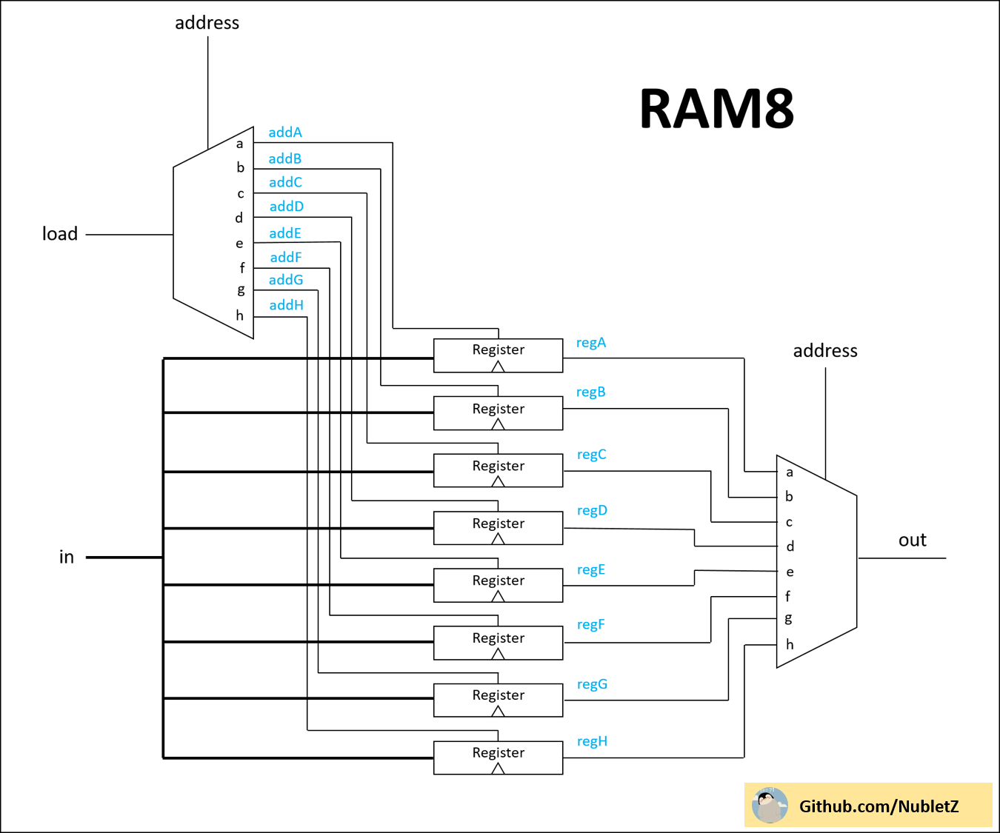
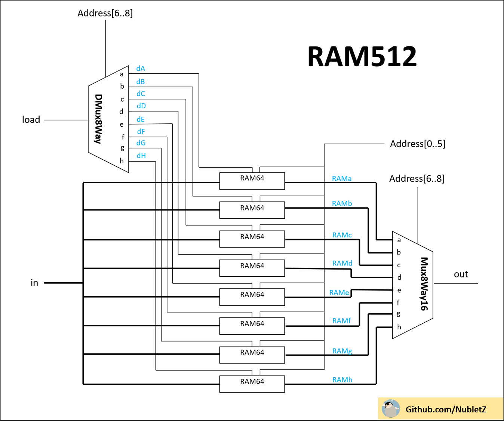
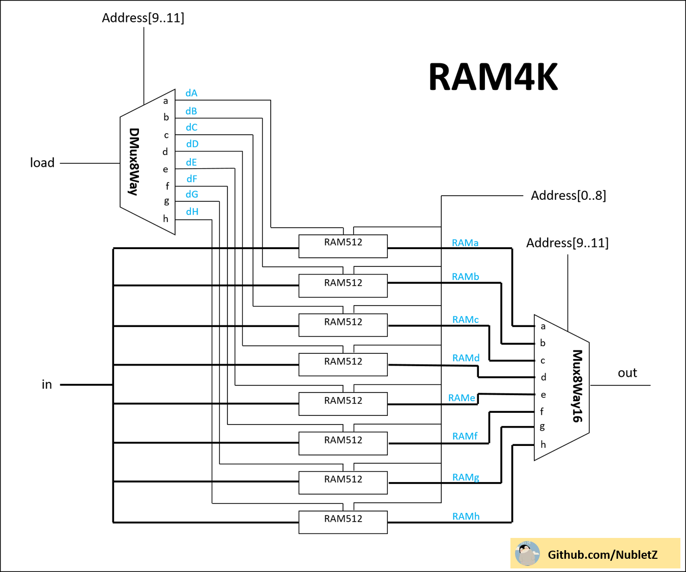

第七週習題 -- 第三章前4-8題
===
## 1. RAM8
### 1.1. Picture


> * A sequence of 8 addressable registers

### 1.2. Code
```
// This file is part of www.nand2tetris.org
// and the book "The Elements of Computing Systems"
// by Nisan and Schocken, MIT Press.
// File name: projects/03/a/RAM8.hdl

/**
 * Memory of 8 registers, each 16 bit-wide. Out holds the value
 * stored at the memory location specified by address. If load==1, then 
 * the in value is loaded into the memory location specified by address 
 * (the loaded value will be emitted to out from the next time step onward).
 */

CHIP RAM8 {
    IN in[16], load, address[3];
    OUT out[16];

    PARTS:
    // Put your code here:
    DMux8Way(in=load, sel=address, a=addA, b=addB, c=addC, d=addD, e=addE, f=addF, g=addG, h=addH);
    Register(in=in, load=addA, out=regA);
    Register(in=in, load=addB, out=regB);
    Register(in=in, load=addC, out=regC);
    Register(in=in, load=addD, out=regD);
    Register(in=in, load=addE, out=regE);
    Register(in=in, load=addF, out=regF);
    Register(in=in, load=addG, out=regG);
    Register(in=in, load=addH, out=regH);
    Mux8Way16(a=regA, b=regB, c=regC, d=regD, e=regE, f=regF, g=regG, h=regH, sel=address, out=out);
}
```

## 2. RAM64
### 2.1. Picture


> * A sequence of 64 addressable registers

### 2.2. Code
```
// This file is part of www.nand2tetris.org
// and the book "The Elements of Computing Systems"
// by Nisan and Schocken, MIT Press.
// File name: projects/03/a/RAM64.hdl

/**
 * Memory of 64 registers, each 16 bit-wide. Out holds the value
 * stored at the memory location specified by address. If load==1, then 
 * the in value is loaded into the memory location specified by address 
 * (the loaded value will be emitted to out from the next time step onward).
 */

CHIP RAM64 {
    IN in[16], load, address[6];
    OUT out[16];

    PARTS:
    // Put your code here:
    DMux8Way(in=load, sel=address[3..5], a=dA, b=dB, c=dC, d=dD, e=dE, f=dF, g=dG, h=dH);
    RAM8(in=in, load=dA, address=address[0..2], out=RAMa);
    RAM8(in=in, load=dB, address=address[0..2], out=RAMb);
    RAM8(in=in, load=dC, address=address[0..2], out=RAMc);
    RAM8(in=in, load=dD, address=address[0..2], out=RAMd);
    RAM8(in=in, load=dE, address=address[0..2], out=RAMe);
    RAM8(in=in, load=dF, address=address[0..2], out=RAMf);
    RAM8(in=in, load=dG, address=address[0..2], out=RAMg);
    RAM8(in=in, load=dH, address=address[0..2], out=RAMh);
    Mux8Way16(a=RAMa, b=RAMb, c=RAMc, d=RAMd, e=RAMe, f=RAMf, g=RAMg, h=RAMh, sel=address[3..5], out=out);
}
```

## 3. RAM512
### 3.1. Picture


> * A sequence of 512 addressable registers

### 3.2. Code
```
// This file is part of the materials accompanying the book 
// "The Elements of Computing Systems" by Nisan and Schocken, 
// MIT Press. Book site: www.idc.ac.il/tecs
// File name: projects/03/b/RAM512.hdl

/**
 * Memory of 512 registers, each 16 bit-wide. Out holds the value
 * stored at the memory location specified by address. If load==1, then 
 * the in value is loaded into the memory location specified by address 
 * (the loaded value will be emitted to out from the next time step onward).
 */

CHIP RAM512 {
    IN in[16], load, address[9];
    OUT out[16];

    PARTS:
    // Put your code here:
    DMux8Way(in=load, sel=address[6..8], a=dA, b=dB, c=dC, d=dD, e=dE, f=dF, g=dG, h=dH);
    RAM64(in=in, load=dA, address=address[0..5], out=RAMa);
    RAM64(in=in, load=dB, address=address[0..5], out=RAMb);
    RAM64(in=in, load=dC, address=address[0..5], out=RAMc);
    RAM64(in=in, load=dD, address=address[0..5], out=RAMd);
    RAM64(in=in, load=dE, address=address[0..5], out=RAMe);
    RAM64(in=in, load=dF, address=address[0..5], out=RAMf);
    RAM64(in=in, load=dG, address=address[0..5], out=RAMg);
    RAM64(in=in, load=dH, address=address[0..5], out=RAMh);
    Mux8Way16(a=RAMa, b=RAMb, c=RAMc, d=RAMd, e=RAMe, f=RAMf, g=RAMg, h=RAMh, sel=address[6..8], out=out);
}
```

## 4. RAM4K
### 4.1. Picture


> * A sequence of 4096 addressable registers

### 4.2. Code
```
// This file is part of www.nand2tetris.org
// and the book "The Elements of Computing Systems"
// by Nisan and Schocken, MIT Press.
// File name: projects/03/b/RAM4K.hdl

/**
 * Memory of 4K registers, each 16 bit-wide. Out holds the value
 * stored at the memory location specified by address. If load==1, then 
 * the in value is loaded into the memory location specified by address 
 * (the loaded value will be emitted to out from the next time step onward).
 */

CHIP RAM4K {
    IN in[16], load, address[12];
    OUT out[16];

    PARTS:
    // Put your code here:
    DMux8Way(in=load, sel=address[9..11], a=dA, b=dB, c=dC, d=dD, e=dE, f=dF, g=dG, h=dH);
    RAM512(in=in, load=dA, address=address[0..8], out=RAMa);
    RAM512(in=in, load=dB, address=address[0..8], out=RAMb);
    RAM512(in=in, load=dC, address=address[0..8], out=RAMc);
    RAM512(in=in, load=dD, address=address[0..8], out=RAMd);
    RAM512(in=in, load=dE, address=address[0..8], out=RAMe);
    RAM512(in=in, load=dF, address=address[0..8], out=RAMf);
    RAM512(in=in, load=dG, address=address[0..8], out=RAMg);
    RAM512(in=in, load=dH, address=address[0..8], out=RAMh);
    Mux8Way16(a=RAMa, b=RAMb, c=RAMc, d=RAMd, e=RAMe, f=RAMf, g=RAMg, h=RAMh, sel=address[9..11], out=out);
}
```

## 5. RAM16K
### 5.1. Picture


> * A sequence of 16384 addressable registers

### 5.2. Code
```
// This file is part of www.nand2tetris.org
// and the book "The Elements of Computing Systems"
// by Nisan and Schocken, MIT Press.
// File name: projects/03/b/RAM16K.hdl

/**
 * Memory of 16K registers, each 16 bit-wide. Out holds the value
 * stored at the memory location specified by address. If load==1, then 
 * the in value is loaded into the memory location specified by address 
 * (the loaded value will be emitted to out from the next time step onward).
 */

CHIP RAM16K {
    IN in[16], load, address[14];
    OUT out[16];

    PARTS:
    // Put your code here:
    DMux4Way(in=load, sel=address[12..13], a=dA, b=dB, c=dC, d=dD);
    RAM4K(in=in, load=dA, address=address[0..11], out=RAMa);
    RAM4K(in=in, load=dB, address=address[0..11], out=RAMb);
    RAM4K(in=in, load=dC, address=address[0..11], out=RAMc);
    RAM4K(in=in, load=dD, address=address[0..11], out=RAMd);
    Mux4Way16(a=RAMa, b=RAMb, c=RAMc, d=RAMd, sel=address[12..13], out=out);
}
```
